[TOC]

### Kafka

#### 概述

Kafka 是基于发布/订阅的消息系统, 是一个**基于 Zookeeper 协调的分布式消息系统**, 是一个分布式流式处理平台. 

Kafka 主要特点: 

- 以时间复杂度为 O(1) 的方式提供**消息持久化**能力, 即使对 TB 级以上数据也能保证**常数时间复杂度的访问性能**. 
- **高吞吐率**. 能做到单机支持**每秒 100K 条以上**消息传输. 
- 支持 Kafka Server 间的消息分区及分布式消费, 同时保证**每个 Partition 内的消息顺序传输**. 
- 同时支持离线数据处理和实时数据处理. 
- 支持在线水平扩展. 

Kafka 主要应用场景: 

- **消息队列**: 建立实时流数据管道, 以可靠地在系统或应用程序之间获取数据. 
- **数据处理:** 构建实时的流数据处理程序来转换或处理数据流. 
- **日志收集**: 可以用 Kafka 收集各种服务的日志, 并以**统一接口服务**的方式开放给各种消费者, 如 Hadoop、Hbase、Solr 等. 
- **用户活动跟踪**: 可以用于记录用户的浏览网页, 搜索, 点击等活动, 这些信息被各个服务器发布到 Kafka, 消费者者通过订阅这些信息来做实时监控分析, 或者装载到 Hadoop, 数据仓库中做离线分析和挖掘. 
- **运营指标**: 可以用来记录运营监控数据. 包括收集各种分布式应用数据, 生产各种操作的集中反馈, 比如报警和报告. 

#### Kafka架构模型

整体架构如下所示.

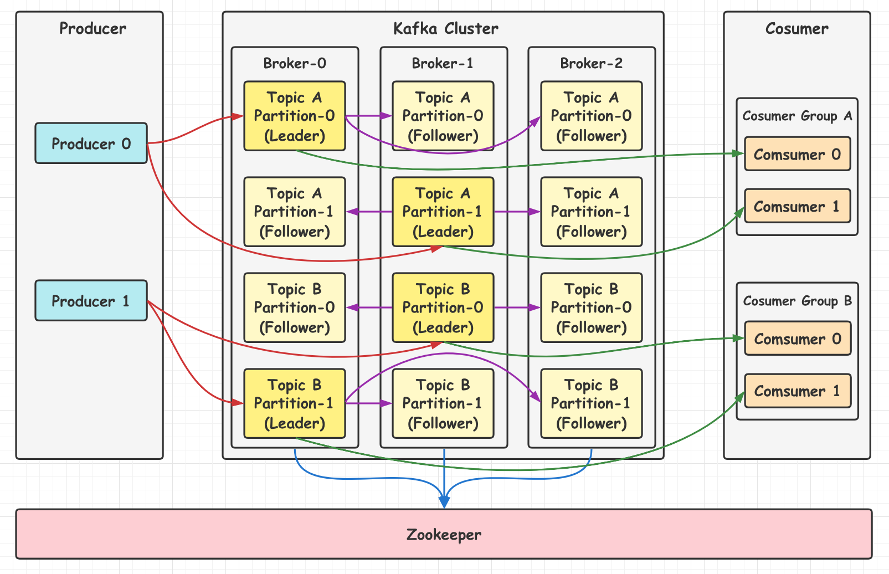

- **Producer(生产者)**: 消息生产者. 
- **Consumer(消费者)**: 消息消费者. 
- **Consumer Group(消费者组)**: 由多个 consumer 组成. 消费者组内每个消费者负责消费**不同分区** 的数据, 一个分区只能由一个消费者消费, 消费者组之间互不影响. 消费者组是逻辑上的一个订阅者. 如果只有一个消费组, 那么架构其实就是消息模型中的**点对点模型**; 如果有多个消费组, 那就对应消息模型中的**发布订阅模型**. 
- **Broker**: 可以看作是一个独立的 Kafka **服务器实例**. 多个 Broker 组成 Kafka Cluster. 

- **Topic(主题)**: 生产者将消息发送到特定的**主题**, 消费者需订阅特定的主题来消费消息. 
- **Partition(分区)**: 主要使用来实现负载均衡. Partition 属于 Topic 的一部分. 一个 **Topic 可以有多个 Partition**, 同一 Topic 下的 Partition 可以**分布在不同的 Broker 上**, 这表明一个 Topic 可以分布在多个 Broker. Kafka 中的 **Partition** 可以理解为为**消息队列中的队列**. 
- **Replica**: 为保证集群中的某个节点发生故障时, 该节点上的 Partition 数据不丢失, Kafka 提供了**副本机制**, 一个 Topic 的每个分区都有若干个副本, 副本包含一个 **leader** 和若干个 **follower**. 
- **Leader**: 每个分区**多个副本的 "主"**, 生产者发送数据的对象, 以及消费者消费数据的对象都是 leader. 

- **Follower**: 每个分区**多个副本中的 "从"**, 实时从 leader 中**同步**数据, 保持和 leader 数据的一致. leader 发生故障时, 会选举一个 follower 会成为新的 leader. 

服务端(Brokers)和客户端(Producer、Consumer)之间通过 **TCP 协议**完成通信. 

#### 生产者

##### 1.写消息流程

Kafka 每次发送数据都是向 Leader 分区发送数据, 并顺序写入到磁盘, 然后 Leader 分区会将数据同步到各个 Follower 分区. 

数据写入分区的原则: 1.数据在写入的时候可以指定需要写入的分区, 如果有则写入指定的分区; 2.如果没有指定分区, 但设置了数据 key, 则根据 key 值 hash 出一个分区; 3.如果既没指定分区也没有设置 key, 则轮询选出一个分区.

发现消息的整体流程如下: 

1. 首先创建一个 **ProducerRecord**, 这个对象需要包含消息的**主题(topic)和值(value)**, 可以选择性**指定一个键值(key)或分区(partition)**. 
2. 发送消息时, 生产者会将键和值**序列化为字节数组**, 然后发送到**分配器(partitioner)**. 
3. 如果指定了**分区**, 那么分配器返回该分区即可; 否则分配器将会**基于键值**来选择一个分区并返回. 
4. 选择完分区后, 生产者知道了消息所属的主题和分区, 它将这条记录添加到相同主题和分区的**批量消息**中, 另一个线程负责发送这些批量消息到对应的 broker. 
5. broker 接收到消息后, 如果成功写入则**返回一个包含消息的主题、分区及位移的 RecordMetadata 对象**, 否则返回异常. 
6. 生产者接收到结果后, 对于异常可能会进行重试. 

##### 2.写消息模型

Kafka 中 **Partition(分区)是存储保存消息的地方**, 发送的消息都被放在分区里. 每次添加消息到 Partition 的时候都会采用**尾加法**, 如图所示.

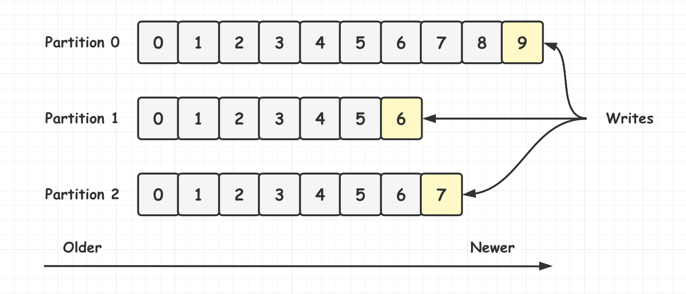

#### 消费者

##### 1.消费者与消费组

消费者需要主动从 Leader 分区拉取数据. 

**多个消费者可以组成一个消费组, 同一个消费组者的消费者可以消费同一个 topic 下不同分区的数据, 但一个分区的消息只会被一个消费组内的一个消费者消费, 防止出现重复消费的问题. 注意: 不同的消费者组, 依然可以消费同一个分区的数据**. 

假设有一个 T1 主题, 该主题有 4 个分区. 同时有一个消费组 G1, 该消费组只有一个消费者 C1. 那么 C1 将会消费这 4 个分区的消息, 如下所示.

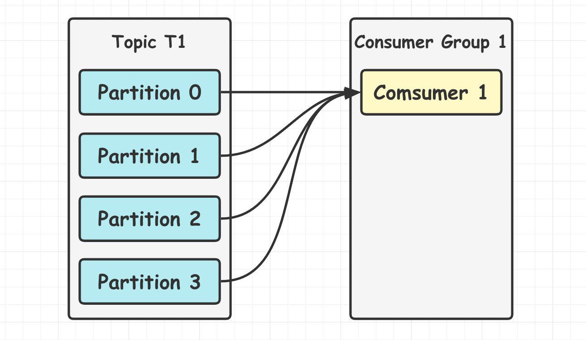

如果增加新的消费者 C2 到消费组 G1, 那么每个消费者将会分别消费**两个分区**的消息, 如下所示: 

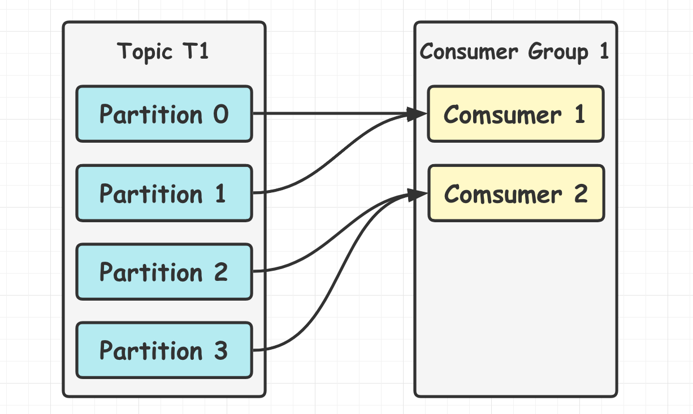

如果增加到 4 个消费者, 那么每个消费者将会分别消费**一个分区**的消息, 如下所示: 

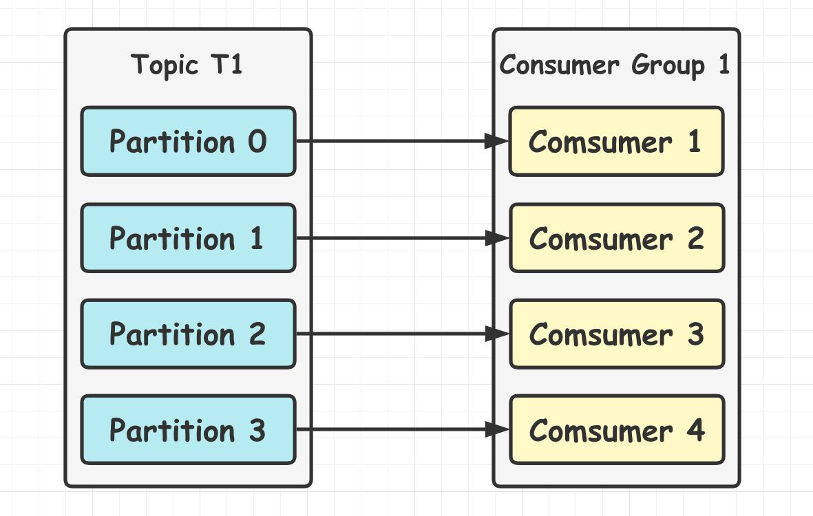

但如果继续增加消费者到这个消费组, **剩余的消费者将会空闲**, 不会消费任何消息: 

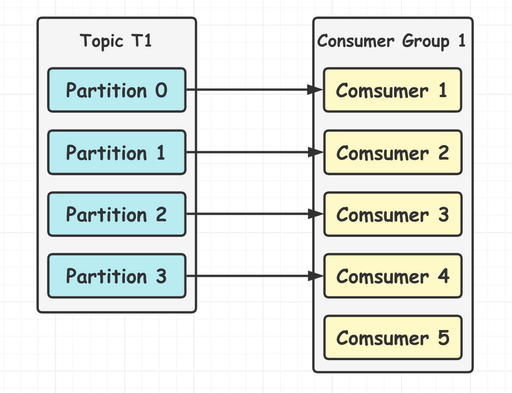

总而言之, 当消费速度低于生产速度引起消息堆积时, 可以通过增加消费者数量来进行水平扩展提升消费能力. 因此建议创建主题时选择使用适量的分区数, 这样可以在消费负载高的情况下增加消费者来提升性能. 注意: 消费者的数量**不应该比分区数多**, 因为多出来的消费者是空闲的, 没有任何帮助. 

**Kafka 只需写入一次消息, 就能支持任意多的应用读取这个消息. **换句话说, **每个应用都可以消费全量的消息**. 为了使得每个应用都能读到全量消息, 应用需要有**不同的消费组**. 假如新增了一个新的消费组 G2, 而这个消费组有**两个消费者**, 那么消费方式如下. 

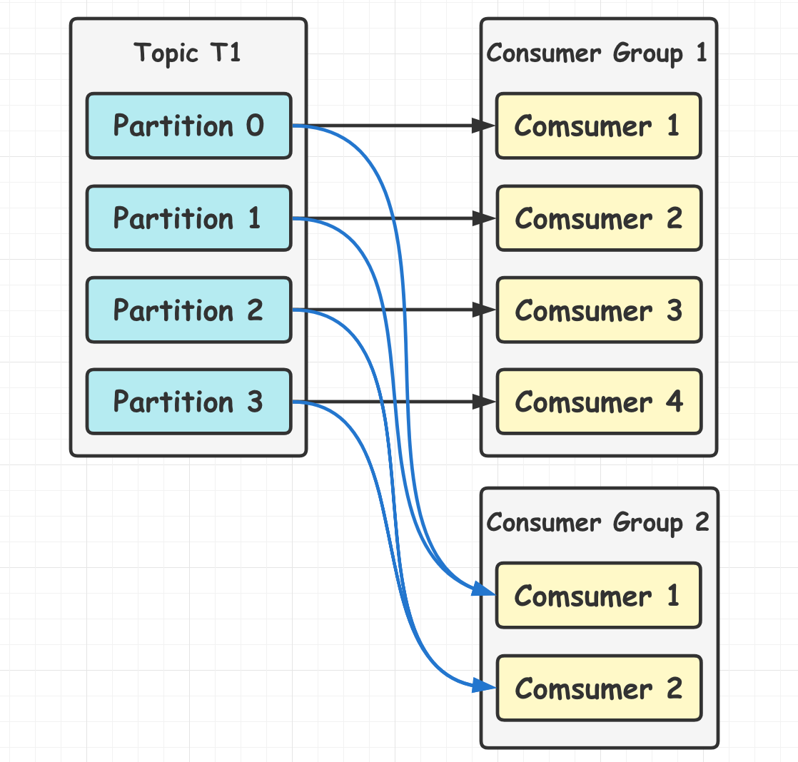

这里消费组 G1 和 G2 都能收到 T1 主题的**全量消息**, 在逻辑意义上来说它们**属于不同的应用**. 

如果应用需要读取全量消息, 那需要为该应用设置一个消费组; 如果该应用消费能力不足, 那么考虑在这个消费组里增加消费者. 实际的应用中, 建议消费者组的消费者数量与分区数量保持一致.

##### 2.分区重平衡

当**新的消费者**加入**消费组**, 它会消费一个或多个分区, 而这些分区之前是由其他消费者负责的; 或当有消费者离开消费组(如重启、宕机等)时, 它所消费的分区会**分配给其他分区**. 这种现象称为**重平衡(rebalance)**. 重平衡保证了高可用和水平扩展.

**注意: 在重平衡期间, 所有消费者都不能消费消息, 因此会造成整个消费组短暂的不可用**. 将分区进行重平衡也会导致原来的消费者状态过期, 导致消费者需要重新更新状态, 这段期间也会降低消费性能. 

消费者通过**定期发送心跳**(hearbeat)到一个作为组协调者(group coordinator)的 broker 来保持在消费组内存活. 这个 broker 不是固定的, 每个消费组都可能不同. 当消费者拉取消息或者提交时, 便会发送心跳. 如果消费者超过一定时间没有发送心跳, 那么它的**会话(session)就会过期**, 组协调者会认为该消费者已经宕机, 然后触发重平衡. 从消费者宕机到会话过期是有一定时间的, 这段时间内该消费者的分区都不能进行消息消费. 可以进行**优雅关闭**, 这样消费者会发送离开的消息给组协调者, 这样组协调者可以**立即进行重平衡**而不需要等待会话过期. 

Kafka 将发送心跳与拉取消息进行分离, 这样发送心跳的频率不受拉取的频率影响. 高版本的 Kafka 支持配置一个消费者多长时间不拉取消息但仍然保持存活, 这个配置可以避免活锁(livelock). **活锁**是指应用没有故障但是由于某些原因不能进一步消费. 

##### 3.Kafka消费模式

消费者从 Broker 获取到数据有两种方式. 1.push 模式: Broker 向消费者**推送数据**; 2.pull 模式: 消费者从 Broker **拉取数据**.

**push 模式**的目标是尽可能以最快速度传递消息, 但是这样很容易造成消费者来不及处理消息, 典型的表现就是拒绝服务以及网络拥塞. push 模式很难适应消费速率不同的消费者, 因为这种模式下消息发送速率由 broker 决定. 而 **pull 模式**则可以根据消费者的**消费能力**以适当的速率消费消息. 

**对 Kafka 而言, pull 模式更合适. **消费者可以自己控制**消费消息的速率**, 也可以自己控制消费方式: 即可批量消费也可逐条消费, 同时还能选择不同的提交方式从而实现不同的传输语义. 

##### 4.消费位置

分区中的**消息可以被不同的消费组多次消费**, 那分区中被消费的消息是何时删除的? 分区又是如何知道一个消费组当前消费的位置呢?

无论消息是否被消费, **分区从不删除消息, 除非消息到期**. 如设置保留时间为 2 天, 则消息发布 2 天内任何消费组都可以消费, 2 天后消息自动被删除. 

Partition 会为**每个消费组保存一个偏移量**, 记录**消费组消费到的位置**. 如下图: 

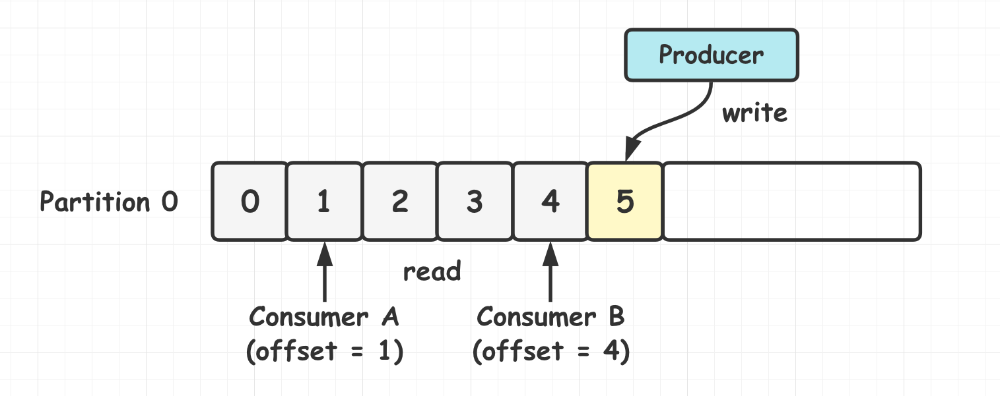

##### 5.消息消费顺序

在使用消息队列的过程中经常有业务场景需要**严格保证**消息的消费顺序, 比如同时发了 2 个消息, 这 2 个消息对应的操作分别对应的数据库操作是: 更改用户会员等级、根据会员等级计算订单价格. 假如这两条消息的消费顺序不一样造成的最终结果就会截然不同.

Kafka 中一个 topic 的消息是**被打散分配到多个分区中存储的**, 消费组在消费时需要从不同分区获取消息, 那最终如何重建出 Topic 中消息的**顺序**? 答案是: **没有办法**. **Kafka 只会保证在同一个分区内消息是有序的, 而不管全局的情况**. 


Kafka 只能保证**一个 Partition(分区) 中的消息有序**, 而**不能保证 Topic(主题) 中所有 Partition(分区) 的全局有序性**. 

消息在被追加到分区的时候都会**分配一个特定的偏移量**(offset), 偏移量表示消费者当前消费到分区的所在位置. Kafka **通过偏移量来保证消息在分区内的顺序性**. 

Kafka 发送一条消息的时候, 可以指定 **topic, partition, key, data** 等参数. 如果发送消息时指定了 Partition 参数, 则所有消息都**会被发送到指定的分区**. 并且同一个 key 的消息可以**保证只发送到同一个分区**. 这里可以采用表/对象的 id 来作为 key. 

##### 6.保证消息不丢失/可靠性

###### (1)生产者丢失消息

生产者发送消息之后, 消息可能因为**网络问题**并没有发送到消息队列, 所以不能认为发送消息就一定会成功. 为确定消息是否发送成功, **需要判断消息发送的结果**. 可以**添加回调函数**, 如果消息发送失败, 检查失败原因后**重新发送**即可!

推荐为生产者的 **retries(重试次数)设置一个比较合理的值**, 一般是 **3**, 为保证消息不丢失也可以设置比较大一点. 设置完成后, 当出现网络问题时能够**自动重试消息发送**, 避免消息丢失.

###### (2)消费者丢失消息

消息在被追加到分区的时候都会**分配一个特定的偏移量**, 通过**偏移量(offset)可以保证消息在分区内的顺序性**. 

当消费者**拉取**到了分区的某个消息之后, **消费者会自动提交 offset**. 自动提交可能存在问题, 即当消费者刚拿到这个消息准备进行真正消费的时候, 突然挂了, **消息实际上并没有被消费, 但 offset 却被自动提交了**. 

**解决办法也比较粗暴, 关闭自动提交 offset, 每次在真正消费完消息之后再自己手动提交 offset. **但这样会带来消息被**重复消费**的问题. 比如刚刚消费完消息后还没提交 offset, 结果消费者挂了, 消费者恢复后会再次拉取并消费前一次的消息, 造成重复消费. 

###### (3)Kafka弄丢消息

Kafka 为分区引入了多副本(Replica)机制. 如果 leader 副本所在的 broker 突然挂掉, 那就需要从 follower 副本重新选出一个 leader. 如果挂掉的 leader 数据还有一些没有被 follower 副本的同步的话, 就会造成消息丢失. 

解决方法: 

- **设置 acks = all**. acks 是为生产者配置的参数. acks 默认值为 1, 代表消息被 leader 接收之后就算发送成功. 配置 **acks = all** 代表则**所有副本都要接收到该消息**之后该消息才算发送成功. 
- **设置 replication.factor >= 3**. 可以保证每个分区至少有 3 个副本. 虽然造成了数据冗余, 但提高了数据安全性. 
- **设置 min.insync.replicas > 1**. 这个配置代表消息至少要被写入到 **2 个副本**才算是被成功发送. min.insync.replicas 默认值为 1, 生产环境中应尽量避免使用默认值. 但为了保证整个 Kafka 服务的高可用性, 需要确保 **replication.factor > min.insync.replicas**. 为什么? 因为在两者相等的情况下, 只要有一个副本挂掉, 整个分区就无法正常工作了. 这明显违反高可用性! 一般推荐设置为 **replication.factor = min.insync.replicas + 1**. 

##### 7.保证消息不被重复消费

如何保证消息**不被重复消费**, 也就是保证消息消费的**幂等性**.

###### (1)重复消费问题

**每个消息**被写进去后都有一个 **offset**, 代表消息顺序. 当消费者消费该数据之后, 会把**自己消费过的消息的 offset 进行提交**, 代表已经消费过了. 下次要是重启, 就会继续从上次**消费到的 offset** 继续消费. 

如果直接消费者突然挂到后再重启, 就可能导致消费者已经消费了消息, 但**没来得及提交 offset**. 等重启之后, 少数消息就会**再次消费一次**. 

其他 MQ 也会有重复消费的问题, 需要针对实际场景来考虑如何保证重复消费的**幂等性**. 

###### (2)保证幂等性 

**怎么保证消息队列消费的幂等性?** 需要结合业务来思考. 

- 通过 **insertOrUpdate** 的方式进行数据写库.
- 如果是**写 Redis** 则大部分没有问题.
- 对于消息可以单独**建表**, 用于存储消息消费记录. 生产者发送消息前**判断库中是否有记录**, 没有记录则先入库, 状态为**待消费**, 发送消息时把主键 id 带上. 消费者接收消息时通过主键 id 查询记录表, 判断消息状态是否已消费. 若没有消费, 则处理消息, 处理完后, 更新消息记录的状态为已消费. 

#####  8.offset的维护

由于消费者在消费过程中可能会出现断电宕机等故障, 故障恢复后, 需要从故障前的位置继续消费, 所以消费者需要实时记录自己消费到了哪个 **offset**, 以便故障恢复后继续消费. 

**group + topic + partition(GTP) 才能确定一个 offset!**

消费者默认**将 offset 保存在 Kafka 本地一个内置的 topic 中**, 该 topic 为 **__consumer_offsets**(此时消费者对于 offset 相当于生产者). 

#### 可靠性

##### 1.概述

Kafka 中的可靠性保证有如下四点: 

- 对于**一个分区**来说, 它的**消息是有序**的. 
- 当消息写入所有 **in-sync 状态的副本**后, 消息才会认为**已提交(committed)**. 这里的写入有可能只是写入到文件系统的**缓存**, 不一定刷新到磁盘. 生产者可以等待不同时机的确认, 比如等待分区主副本**写入即返回**, 或者等待所有 in-sync 状态副本写入才返回. 
- 一旦消息已提交, 只要有一个副本存活, 数据就不会丢失. 
- 消费者只能**读取到已提交**的消息. 

可靠性不是无偿的, 它与系统可用性, 吞吐量, 延迟息息相关, 因此往往需要做权衡, 只追求可靠性并不实际. 

##### 2.多副本机制

Kafka 为分区引入了**多副本(Replica)机制**. 分区中的多个副本之间会有一个 leader 副本, 其他副本称为 **follower** 副本. 发送的消息会**被发送到 leader 副本**, 然后 follower 副本才能从 leader 副本中**拉取消息进行同步**. 

生产者和消费者**只与 leader 副本交互**. 其他副本只是 leader 副本的**拷贝**, 它们的存在只是为了**保证消息存储的安全性**. 当 leader 副本发生故障时会从 follower 中**选举出一个 leader**. follower 副本如果与 leader 同步程度达不到要求则无法参与 leader 选举. 

**多副本机制的好处**: 

- 通过给特定 Topic 指定多个分区, 而各个分区可以**分布在不同的 Broker 上**, 这样能提供较好的并发能力(**负载均衡**). 
- 分区可以指定对应的 Replica 数量, 这可以提高消息存储**安全性**, 提高容灾能力, 不过也相应的增加了所需的存储空间. 

##### 3.副本数据同步策略

|             **方案**             |                         **优点**                         |                          **缺点**                           |
| :------------------------------: | :------------------------------------------------------: | :---------------------------------------------------------: |
| **半数以上完成同步, 就发送 ack** |                          延迟低                          | 选举新的 leader 时, 容忍 n 台节点的故障, 需要 2n + 1 个副本 |
|   **全部完成同步, 才发送 ack**   | 选举新 leader 时, 容忍 n 台节点的故障, 需要 n + 1 个副本 |                           延迟高                            |

Kafka 选择了第二种方案, 原因如下: 

- 同样为了容忍 n 台节点的故障, 第一种方案需要 2n + 1 个副本, 而第二种方案只需要 n + 1 个副本, Kafka 的每个分区都有大量数据, 第一种方案会造成大量数据冗余. 
- 虽然第二种方案的网络延迟会比较高, 但网络延迟对 Kafka 的影响较小(一般在同一网络环境下传输). 

#### Kafka与Zookeeper

ZooKeeper 主要为 Kafka 提供**元数据管理**的功能. 

1. **Broker 注册**: Zookeeper 上有一个专门**用来进行 Broker 服务器列表记录**的节点. 每个 Broker 启动时, 都会到 Zookeeper 上进行**注册**, 即到 **/brokers/ids** 下创建属于自己的节点. 每个 Broker 就会将自己的 IP 地址和端口等信息记录到该节点中. 
2. **Topic 注册**: 在 Kafka 中, 同一个 Topic 的消息会被**分成多个分区并将其分布在多个 Broker 上**, 这些分区信息及与 Broker 的**对应关系也是由 Zookeeper 维护**. 比如创建了一个名字为 **my-topic** 的主题并且它有两个分区, 对应到 Zookeeper 中会创建下面的文件夹: **/brokers/topics/my-topic/Partitions/0, /brokers/topics/my-topic/Partitions/1**. 
3. **负载均衡**: 对于同一个 Topic 的不同分区, Kafka 会**尽力将这些分区分布到不同的 Broker 服务器上**. 当生产者产生消息后也会尽量投递到不同 Broker 的分区里面. 当消费者进行消费时, Zookeeper 可以根据当前的分区数量以及消费者数量来实现**动态负载均衡**. 

#### Kafka与存储实现

##### 1.Kafka与文件系统

Kafka 的消息是**存在于文件系统**之上的. Kafka 高度依赖文件系统来**存储和缓存**消息. 有的人认为"磁盘是缓慢的", 所以对这样的设计持有怀疑态度. 实际上磁盘可以比预想的快很多或慢很多, 这取决于它们如何被使用; 一个好的磁盘结构设计可以使之与网络速度一样快. 

现代的操作系统针对**磁盘的读写**已经做了一些优化方案来加快磁盘的访问速度. 比如"**预读**"会提前将一个比较大的磁盘数据块读入内存. "**后写**"会将很多小的逻辑写操作合并起来组合成一个大的物理写操作. 并且操作系统还会将主内存剩余的所有空闲内存空间都用作**磁盘缓存**, 所有的磁盘读写操作都会经过统一的磁盘缓存(除了直接 I/O 会绕过磁盘缓存). 综合这几点优化特点, 如果是针对磁盘的**顺序访问**, 某些情况下它可能比随机的内存访问都要快, 甚至可以和网络速度相差无几. 

**Topic 其实是逻辑上的概念, 面向消费者和生产者, 物理上存储的其实是 Partition**, 每一个 Partition 最终对应一个**目录, 里面存储所有的消息和索引文件**. 默认情况下, 每个 Topic 在创建时如果不指定 Partition 数量时只会创建 1 个 Partition. 比如创建一个 Topic 名字为 test, 没有指定 Partition 的数量时会默认创建一个 **test-0 的文件夹**, 这里的命名规则是: **<topic_name>-<partition_id>**. 


任何发布到 Partition 的消息都会被**追加到 Partition 数据文件的尾部**, 这样的**顺序写磁盘操作让 Kafka 的效率非常高**. 经验证, **顺序写磁盘**效率可能比随机写内存还要高, 这是 Kafka 高吞吐率的一个重要保证. 

每一条消息被发送到 Broker 中, 会**根据 Partition 规则**选择被存储到哪一个 Partition. 如果 Partition 规则设置的合理, 所有消息可以均匀分布到不同的 Partition 中. 

##### 2.底层存储细节

假设 Kafka 集群**只有一个 Broker**, 创建 2 个 Topic 名称分别为: "topic1" 和 "topic2", Partition 数量分别为 1, 2, 那么的**根目录**下就会创建如下**三个文件夹**: 

```shell
| --topic1-0
| --topic2-0
| --topic2-1
```

在 Kafka 的**文件存储**中, **同一个 Topic 下有多个不同的 Partition**, 每个 Partition 都为一个**目录**, 而每一个目录又被平均分配成多个大小相等的 **Segment File**, Segment File 又由 **index file 和 data file 组成**, 它们总是**成对出现**, 后缀 ".index" 表示**索引文件**, ".log" 表示**数据文件**. **索引文件中的元数据指向对应数据文件中** message 的物理偏移地址. 

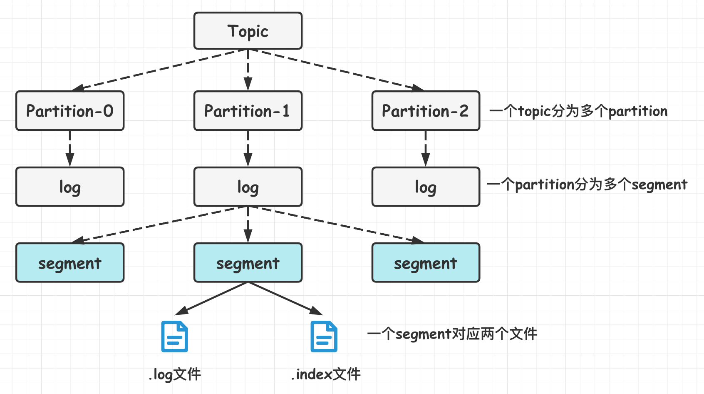

假设设置每个 Segment 大小为 500 MB, 并启动生产者向 topic1 发送大量消息, topic1-0 文件夹中就会产生类似如下的一些文件: 

```shell
| --topic1-0 
   | --00000000000000000000.index 
   | --00000000000000000000.log 
   | --00000000000000368769.index 
   | --00000000000000368769.log 
   | --00000000000000737337.index 
   | --00000000000000737337.log 
   | --00000000000001105814.index 
   | --00000000000001105814.log 
| --topic2-0 
| --topic2-1
```

**Segment 是 Kafka 文件存储的最小单位. **Segment 文件命名规则: Partition 全局的第一个 Segment **从 0** 开始, 后续每个 Segment 文件名为上一个 Segment 文件**最后一条消息的 offset 值**. 数值最大为 64 位 long 大小, 19 位数字字符长度, 没有数字用 0 填充. 如 00000000000000368769.index 和 00000000000000368769.log. 

以上面的一对 Segment File 为例, 说明一下**索引文件和数据文件对应关系**. 

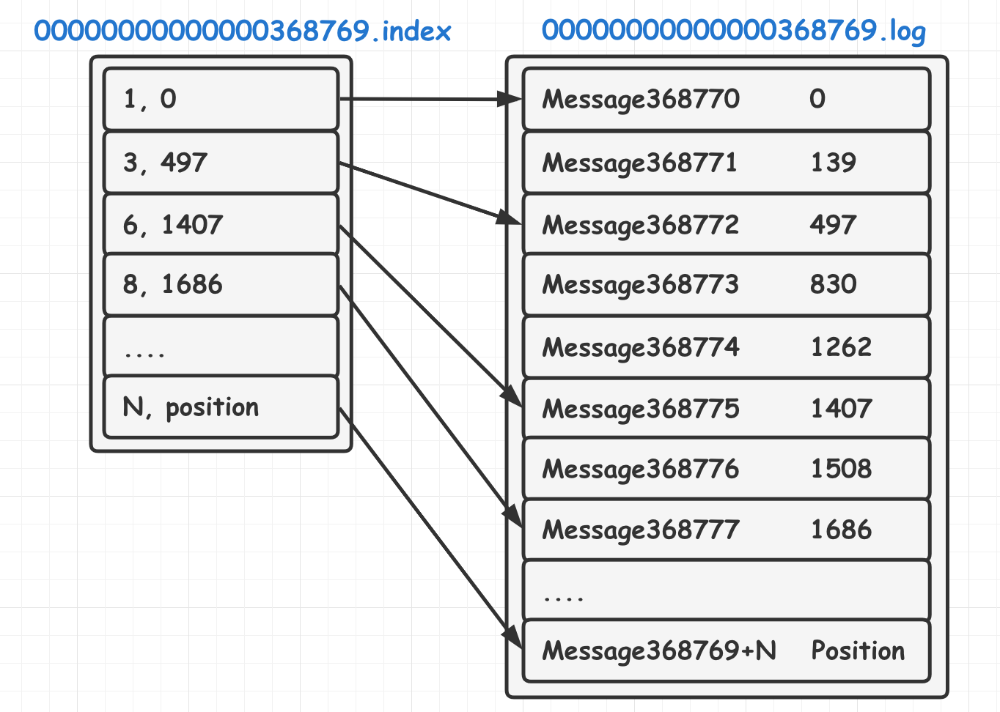

其中以索引文件中元数据 **<3, 497>** 为例, 在数据文件中表示第 3 个 message(在全局 Partition 表示第 368769 + 3 = 368772 个 message)以及该消息的物理偏移地址为 497. 

注意该 index 文件并不是从 0 开始, 也不是每次递增 1 的, 这是因为 Kafka 采取**稀疏索引存储**的方式, 每隔一定字节的数据建立一条索引, 它减少了索引文件大小, 使得能够把 index 映射到内存, 降低了查询时的磁盘 IO 开销, 同时也并没有给查询带来太多的时间消耗. 

因为其文件名为上一个 Segment 最后一条消息的 offset, 所以当需要查找一个指定 offset 的消息时, 通过在所有 segment 的文件名中进行**二分查找**就能找到它归属的 Segment 文件, 再在其 index 文件中找到其对应到文件上的物理位置, 就能获取该消息. 

由于消息在 Partition 的 Segment 数据文件中是**顺序读写**的, 且消息消费后不会删除(删除策略是针对过期的 Segment 文件), 这种顺序磁盘 IO 存储设计师 Kafka 高性能很重要的原因. 

> Kafka 如何准确的知道 message 的偏移?

在 Kafka 定义了标准的数据存储结构, 在 Partition 中的**每一条 message 都包含了以下三个属性**: 

- **offset**: 表示消息在当前 Partition 中的偏移量, 是一个逻辑值, 唯一确定了 Partition 中的一条 message, 可以简单认为是一个 id. 

- **MessageSize**: 表示 message 内容 data 的大小. 

- **data**: message 的具体内容. 

#### Kafka高效读写数据

##### 1.顺序写磁盘

生产者的消息写入到 log 文件的过程是**追加到文件末端的顺序写**. 同样的磁盘, 顺序写能到 **600M/s**, 而随机写只有 **100k/s**. 这与磁盘的机械机构有关, 顺序写之所以快, 是因为其省去了大量磁头寻址的时间. 

##### 2.零拷贝技术

Kafka 的消息会有**多个订阅者**, 生产者发布的消息会被不同的消费者多次消费, 为优化这个流程, Kafka 使用了**"零拷贝技术"**. 

"零拷贝技术" 只用将**磁盘文件的数据复制到页面缓存中一次**, 然后将数据**从页面缓存直接发送到网络中**(发送给不同的订阅者时, 都可以使用同一个页面缓存), 避免了重复复制操作. 

如果有 10 个消费者, 传统方式下, 数据复制次数为 4 * 10 = 40 次, 而使用 "零拷贝" 只需要 1 + 10 = 11 次, 一次为从磁盘复制到页面缓存, 10 次即 10 个消费者各自读取一次页面缓存. 

#### Kafka事务

Kafka 从 0.11 版本开始引入了**事务**. 事务可以保证 Kafka 在 **Exactly Once 语义**的基础上, 生产和消费可以**跨分区和会话, 要么全部成功, 要么全部失败**. **注意**: 这里的事务主要指**生产者**的事务. 

##### 1.生产者事务

为了实现跨分区跨会话的事务, 需要引入一个**全局唯一的 Transaction ID**(**一定是客户端给的**), 并将生产者获得的 PID 和 Transaction ID 绑定. 这样当生产者重启后就可以通过正在进行的 Transaction ID 获得原来的 PID.  

为管理 Transaction, Kafka 引入了一个新的组件 **Transaction Coordinator**. 生产者就是通过与 Transaction Coordinator 交互获得 Transaction ID 对应的任务状态. Transaction Coordinator 还负责将事务所有写入 Kafka 的一个内部 Topic, 这样即使整个服务重启, 由于事务状态得到保存, 进行中的事务状态可以得到恢复, 从而继续进行. 

##### 2.消费者事务 

对于消费者而言, 事务的保证就会相对较弱, 尤其时无法保证 Commit 的信息被精确消费. 这是由于消费者可以通过 offset 访问任意信息, 而且不同的 Segment File 生命周期不同, 同一事务的消息可能会出现重启后被删除的情况. 

### 基本使用

#### Producer API

##### 1.消息发送流程

Producer 发送消息采用的是**异步发送**的方式. 消息发送的过程涉及两个线程: **main 线程和 Sender 线程**, 以及一个线程共享变量: **RecordAccumulator**(接收器). 

**main 线程将消息发送给 RecordAccumulator, Sender 线程不断从 RecordAccumulator 中拉取消息发送到 Kafka broker. **

相关参数: 

- **batch.size**: 只有数据积累到 batch.size 之后, sender 才会发送数据. 
- **linger.ms**: 如果数据迟迟未达到 batch.size, sender 等待 linger.time 之后也会发送数据. 

##### 2.异步发送API

- **KafkaProducer**: 需要创建一个生产者对象, 用于发送数据. 
- **ProducerConfig**: 获取所需的配置参数. 
- **ProducerRecord**: 每条数据都要封装成一个 **ProducerRecord** 对象. 

###### (1)不带回调函数的异步(AsyncProducer)

```java
/** 不带回调函数的异步Producer API */
public class AsyncProducer {
    public static void main(String[] args) {
        Properties props = new Properties();
        props.put(ProducerConfig.BOOTSTRAP_SERVERS_CONFIG,
                  "hadoop101:9092,hadoop102:9092,hadoop103:9092");
        props.put(ProducerConfig.KEY_SERIALIZER_CLASS_CONFIG, StringSerializer.class.getName());
        props.put(ProducerConfig.VALUE_SERIALIZER_CLASS_CONFIG, StringSerializer.class.getName());
        props.put(ProducerConfig.ACKS_CONFIG, "all");
        props.put(ProducerConfig.RETRIES_CONFIG, 1);
        props.put(ProducerConfig.LINGER_MS_CONFIG, 1);
        // 配置拦截器
        // 通过配置创建KafkaProducer对象
        KafkaProducer<String, String> producer = new KafkaProducer<>(props);
        for (int i = 0; i < 1000; i++) {
            ProducerRecord<String, String> record = new ProducerRecord<>("first", "message" + i);
            producer.send(record);
        }
        producer.close();
    }
}
```

###### (2)带回调函数的异步(CallbackProducer)

```java
/** 带回调函数的异步Producer API */
public class CallbackProducer {
    public static void main(String[] args) {
        Properties props = new Properties();
        props.put(ProducerConfig.BOOTSTRAP_SERVERS_CONFIG, "192.168.72.133:9092");
        props.put(ProducerConfig.KEY_SERIALIZER_CLASS_CONFIG, StringSerializer.class.getName());
        props.put(ProducerConfig.VALUE_SERIALIZER_CLASS_CONFIG, StringSerializer.class.getName());
        props.put(ProducerConfig.ACKS_CONFIG, "all");
        props.put(ProducerConfig.RETRIES_CONFIG, 1);
        
        KafkaProducer<String, String> producer = new KafkaProducer<>(props);
        for (int i = 0; i < 1000; i++) {
            ProducerRecord<String, String> record = new ProducerRecord<>("first", "message" + i);
            producer.send(record, new Callback() {
                @Override
                public void onCompletion(RecordMetadata recordMetadata, Exception e) {
                    if (e == null)
                        System.out.println("success:" + recordMetadata.topic() +
                                           "-" + recordMetadata.partition() +
                                           "-" + recordMetadata.offset());
                    else e.printStackTrace();
                }
            }); 
        }
        producer.close();
    }
}
```

##### 3.同步发送API

###### (1)同步发送(SyncProducer)

```java
/** 同步 Producer API */
public class SyncProducer {
    public static void main(String[] args) throws ExecutionException, InterruptedException {
        // 创建properties对象用于存放配置
        Properties props = new Properties();
        // 添加配置
        props.put(ProducerConfig.BOOTSTRAP_SERVERS_CONFIG, "hadoop101:9092,hadoop102:9092,hadoop103:9092");
        props.put(ProducerConfig.KEY_SERIALIZER_CLASS_CONFIG, StringSerializer.class.getName());
        props.put(ProducerConfig.VALUE_SERIALIZER_CLASS_CONFIG, StringSerializer.class.getName());
        props.put(ProducerConfig.ACKS_CONFIG, "all");
        props.put(ProducerConfig.RETRIES_CONFIG, 1); // 重试次数
        props.put(ProducerConfig.LINGER_MS_CONFIG, 500);
        
        // 通过已有配置创建kafkaProducer对象
        KafkaProducer<String, String> producer = new KafkaProducer<>(props);
        // 循环调用 send 方法不断发送数据
        for (int i = 0; i < 100; i++) {
            ProducerRecord<String, String> record = new ProducerRecord<>("first", "message" + i);
            // 通过get()方法实现同步效果
            RecordMetadata metadata = producer.send(record).get();
            if (metadata != null)
                System.out.println("success:" + metadata.topic() + "-" +
                        metadata.partition() + "-" + metadata.offset());
        }
        producer.close(); // 关闭生产者对象
    }
}
```

#### Consumer API

消费者消费数据时的可靠性是比较容易保证的, 因为数据在 Kafka 中是**持久化**的, 故一般不用担心数据丢失问题. 

由于消费者在消费过程中可能会出现断电宕机等故障, 所以 offset 的维护是消费者消费数据时必须考虑的问题. 

##### 1.自动提交offset

- **KafkaConsumer**: 需要创建一个消费者对象, 用于消费数据. 
- **ConsumerConfig**: 获取所需的配置参数. 
- **ConsuemrRecord**: 每条数据都被封装成一个 ConsumerRecord 对象. 

为了能专注于业务逻辑, Kafka 提供了**自动提交 offset** 的功能. 自动提交 offset 的相关参数: 

- **enable.auto.commit**: 是否开启自动提交 offset 功能. 
- **auto.commit.interval.ms**: 自动提交 offset 的时间间隔. 

```java
/** 自动提交 offset */
public class AutoCommitOffset {
    public static void main(String[] args) {
        Properties props = new Properties();
        props.put(ConsumerConfig.BOOTSTRAP_SERVERS_CONFIG, "hadoop101:9092,hadoop102:9092");
        props.put(ConsumerConfig.KEY_DESERIALIZER_CLASS_CONFIG, StringDeserializer.class.getName());
        props.put(ConsumerConfig.VALUE_DESERIALIZER_CLASS_CONFIG, StringDeserializer.class.getName());
        props.put(ConsumerConfig.GROUP_ID_CONFIG, "tian"); // groupid
        props.put(ConsumerConfig.AUTO_OFFSET_RESET_CONFIG, "earliest");
        
        // 配置自动提交
        props.put(ConsumerConfig.ENABLE_AUTO_COMMIT_CONFIG, true); 
        KafkaConsumer<String, String> consumer = new KafkaConsumer<>(props);
        consumer.subscribe(Arrays.asList("first")); // 添加需要消费的 topic
        try {
            while(true){
                ConsumerRecords<String, String> records = consumer.poll(100);
                for (ConsumerRecord<String, String> record : records) {
                    System.out.println(record.value());
                }
            }
        } finally {
            consumer.close();// 在死循环中无法调用 close 方法, 所以需要使用 finally
        }
    }
}
```

但自动提交可能引起**消息消费失败**的问题. 

##### 2.手动提交offset

Kafka 还提供了手动提交 offset 的 API. 手动提交 offset 的方法有两种: 分别是 **commitSync**(**同步提交**)和 **commitAsync**(**异步提交**). 两者的相同点是, 都会将**本次 poll 的一批数据最高的偏移量提交**; 不同点是, commitSync **阻塞当前线程**, 一直到提交成功, 并且会自动失败充实(由不可控因素导致, 也会出现提交失败); 而 commitAsync 则没有失败重试机制, 故有可能提交失败. 

###### (1)同步提交commitSync offset

由于同步提交 offset 有失败重试机制, **故更加可靠**.

```java
/** 同步手动提交 offset */
public class CustomComsumer {

    public static void main(String[] args) {

        Properties props = new Properties();
        props.put("bootstrap.servers", "hadoop102:9092");//Kafka 集群
        props.put("group.id", "test");// 消费者组, 只要 group.id 相同, 就属于同一个消费者组
        // 关闭自动提交 offset
        props.put("enable.auto.commit", "false");
        props.put("key.deserializer", "org.apache.kafka.common.serialization.StringDeserializer");
        props.put("value.deserializer", "org.apache.kafka.common.serialization.StringDeserializer");

        KafkaConsumer<String, String> consumer = new KafkaConsumer<>(props);
        consumer.subscribe(Arrays.asList("first"));// 消费者订阅主题

        while (true) {
            // 消费者拉取数据
            ConsumerRecords<String, String> records = consumer.poll(100);
            for (ConsumerRecord<String, String> record : records) {
                System.out.printf("offset = %d, key = %s, value = %s%n", record.offset(), record.key(), record.value());
            }
            consumer.commitSync();// 同步提交, 当前线程会阻塞直到offset提交成功
        }
    }
}
```

###### (2)异步提交commitAsync offset

虽然同步提交 offset 更可靠一些, 但是由于其会**阻塞当前线程**直到提交成功, 因此**吞吐量会受到很大的影响**. 更多情况下, 会选用异步提交 offset 的方式. 

```java
/** 异步手动提交 offset */
public class AsyncManualCommitOffset {
    public static void main(String[] args) {
        Properties props = new Properties();
        props.put(ConsumerConfig.BOOTSTRAP_SERVERS_CONFIG, "hadoop101:9092");
        props.put(ConsumerConfig.GROUP_ID_CONFIG, "tian");
        props.put(ConsumerConfig.ENABLE_AUTO_COMMIT_CONFIG, false);
        props.put(ConsumerConfig.KEY_DESERIALIZER_CLASS_CONFIG, StringDeserializer.class.getName());
        props.put(ConsumerConfig.VALUE_DESERIALIZER_CLASS_CONFIG, StringDeserializer.class.getName());
        KafkaConsumer<String, String> consumer = new KafkaConsumer<String, String>(props);
        consumer.subscribe(Arrays.asList("first"));
        while (true) {
            ConsumerRecords<String, String> records = consumer.poll(100);
            for (ConsumerRecord<String, String> record : records) {
                System.out.println("offset:" + record.offset() +
                        "key:" + record.key() + "value" + record.value());
            }
            consumer.commitAsync(new OffsetCommitCallback() {
                public void onComplete(Map<TopicPartition, OffsetAndMetadata> map, Exception e) {
                    if (e != null)
                        System.out.println("commit failed for " + map);
                }
            });// 异步提交
        }
    }
}
```

###### (3)数据漏消费和重复消费分析 

无论是同步提交还是异步提交 offset, 都**有可能会造成数据漏消费或重复消费**. **先提交 offset 后消费, 有可能造成数据的漏消费; 而先消费后提交 offset, 有可能会造成数据的重复消费**.

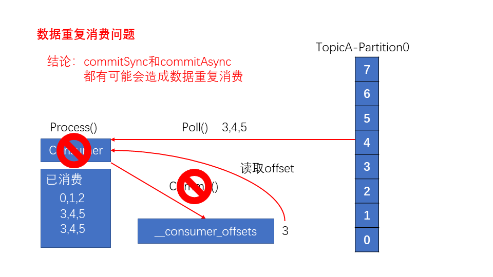

##### 3.自定义存储offset

offset 默认存储在 Kafka 的一个**内置的 topic 中**. 除此之外, Kafka 还可以选择**自定义存储 offset**. 

offset 的维护是相当繁琐的, 因为需要考虑到消费者的 **Rebalance**. 当有新的消费者加入消费者组, 已有的消费者推出消费者组或者所订阅的主题的分区发生变化, 就会**触发到分区的重新分配, 重新分配的过程叫做 Rebalance. **

消费者发生 Rebalance 之后, 每个**消费者消费的分区就会发生变化**. 因此消费者要首先获取到自己被重新分配到的分区, 并且定位到每个分区**最近提交的 offset 位置**继续消费. 

要实现自定义存储 offset, 需要借助 **ConsumerRebalanceListener**. 示例代码如下, 其中提交和获取 offset 的方法, 需要根据所选的 offset 存储系统自行实现. 

```java
/** 自定义存储offset */
public class CustomConsumer {

    private static Map<TopicPartition, Long> currentOffset = new HashMap<>();

    public static void main(String[] args) {
        Properties props = new Properties();
        props.put("bootstrap.servers", "hadoop102:9092");// Kafka集群
        props.put("group.id", "test");// 消费者组, 只要group.id相同, 就属于同一个消费者组
        // 关闭自动提交offset
        props.put("enable.auto.commit", "false");
        props.put("key.deserializer", "org.apache.kafka.common.serialization.StringDeserializer");
        props.put("value.deserializer", "org.apache.kafka.common.serialization.StringDeserializer");

        KafkaConsumer<String, String> consumer = new KafkaConsumer<>(props);
        // 消费者订阅主题
        consumer.subscribe(Arrays.asList("first"), new ConsumerRebalanceListener() {
            
            // 该方法会在Rebalance之前调用
            @Override
            public void onPartitionsRevoked(Collection<TopicPartition> partitions) {
                commitOffset(currentOffset);
            }

            // 该方法会在Rebalance之后调用
            @Override
            public void onPartitionsAssigned(Collection<TopicPartition> partitions) {
                currentOffset.clear();
                for (TopicPartition partition : partitions) {
                    // 定位到最近提交的offset位置继续消费
                    consumer.seek(partition, getOffset(partition));
                }
            }
        });

        while (true) {
            // 消费者拉取数据
            ConsumerRecords<String, String> records = consumer.poll(100);
            for (ConsumerRecord<String, String> record : records) {
                System.out.printf("offset = %d, key = %s, value = %s%n", record.offset(), record.key(), record.value());
                currentOffset.put(new TopicPartition(record.topic(), record.partition()), record.offset());
            }
            commitOffset(currentOffset); 
        }
    }

    // 获取某分区的最新offset
    private static long getOffset(TopicPartition partition) {
        return 0;
    }

    // 提交该消费者所有分区的offset
    private static void commitOffset(Map<TopicPartition, Long> currentOffset) {
    }
}
```


#### 参考资料

- https://www.infoq.cn/article/kafka-analysis-part-1 - Kafka 设计解析(一): Kafka 背景及架构介绍
- [http://www.dengshenyu.com/%E5%88%86%E5%B8%83%E5%BC%8F%E7%B3%BB%E7%BB%9F/2017/11/06/kafka-Meet-Kafka.html](http://www.dengshenyu.com/分布式系统/2017/11/06/kafka-Meet-Kafka.html) - Kafka系列(一)初识Kafka

- https://lotabout.me/2018/kafka-introduction/ - Kafka 入门介绍
- https://www.zhihu.com/question/28925721 - Kafka 中的 Topic 为什么要进行分区? - 知乎
- https://blog.joway.io/posts/kafka-design-practice/ - Kafka 的设计与实践思考
- [http://www.dengshenyu.com/%E5%88%86%E5%B8%83%E5%BC%8F%E7%B3%BB%E7%BB%9F/2017/11/21/kafka-data-delivery.html](http://www.dengshenyu.com/分布式系统/2017/11/21/kafka-data-delivery.html) - Kafka系列(六)可靠的数据传输
- [Kafka系列第三篇!10 分钟学会如何在 Spring Boot 程序中使用 Kafka 作为消息队列?](https://mp.weixin.qq.com/s?__biz=Mzg2OTA0Njk0OA==&mid=2247486269&idx=2&sn=ec00417ad641dd8c3d145d74cafa09ce&chksm=cea244f6f9d5cde0c8eb233fcc4cf82e11acd06446719a7af55230649863a3ddd95f78d111de&token=1633957262&lang=zh_CN#rd)
- [CentOS7 下 Kafka 的安装介绍 - 个人文章 - SegmentFault 思否](https://segmentfault.com/a/1190000012990954)
- 非常重要: [kafka 踩坑之消费者收不到消息 - kris - CSDN 博客](https://blog.csdn.net/qq_25868207/article/details/81516024)
- [kafka 安装搭建(整合 springBoot 使用) - u010391342 的博客 - CSDN 博客](https://blog.csdn.net/u010391342/article/details/81430402)
- [Zookeeper+Kafka 的单节点配置 - 紫轩弦月 - 博客园](https://www.cnblogs.com/ALittleMoreLove/archive/2018/07/31/9396745.html)
- [@KafkaListener 注解解密 - laomei - CSDN 博客](https://blog.csdn.net/sweatOtt/article/details/86714272)
- [使用Docker快速搭建Kafka开发环境 - 简书](https://www.jianshu.com/p/ac03f126980e)
- [Spring for Apache Kafka](https://docs.spring.io/spring-kafka/reference/html)
- [Overview (Spring Kafka 2.2.8.RELEASE API)](https://docs.spring.io/spring-kafka/docs/2.2.8.RELEASE/api/)
- [SpringBoot整合Kafka实现发布订阅 - 简书](https://www.jianshu.com/p/7a284bf4efc9)
- [SpringBoot 集成 Spring For Kafka 操作 Kafka 详解 · 小豆丁个人博客](http://www.mydlq.club/article/34/)
- https://developer.aliyun.com/article/868759


