[TOC]

### 传输层

#### 传输层概述

##### 1.进程间通信

**传输层**向它上面的**应用层**提供**通信服务**，它属于面向通信部分的最高层，同时也是用户功能中的最低层。当网络的**边缘部分**中的两个主机使用**网络的核心部分**的功能进行**端到端的通信**时，只有位于**网络边缘部分**的主机的协议栈才有运输层，而**网络核心部分中的路由器**在**转发分组**时都只用到**下三层**的功能。 

传输层**为==进程==提供通用数据传输服务**。**网络层**只把**分组**发送到**目的主机**，但是真正通信的并不是主机而是主机中的**进程**。传输层提供了进程间的逻辑通信，传输层向高层用户屏蔽了下面网络层的核心细节，使应用程序看起来像是在两个传输层实体之间有一条端到端的逻辑通信信道。

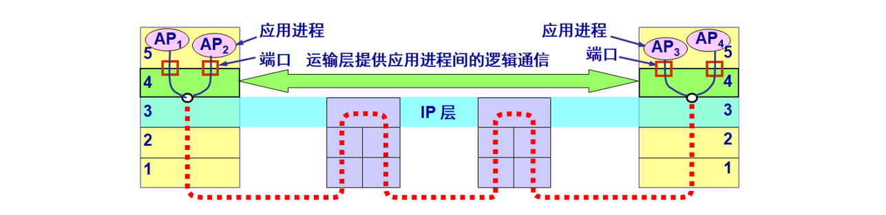

**网络层和传输层的区别**：**网络层**是为**主机之间**提供逻辑通信，而**传输层**为**应用进程**之间提供端到端的逻辑通信。

##### 2.传输层协议

传输层有两种不同的协议，即**面向连接的 TCP** 和**无连接的 UDP** 。

- 用户数据报协议 **UDP** 协议(User Datagram Protocol) 是**无连接**的，使用的是不可靠信道。尽最大可能交付，没有拥塞控制，面向报文(对于应用程序传下来的报文不合并也不拆分，只是添加 UDP 首部)，支持一对一、**一对多**、多对一和多对多的交互通信。传输的是 **UDP用户数据报**。
- 传输控制协议 **TCP** 协议(Transmission Control Protocol) 是**面向连接**的，提供可靠交付，有流量控制，拥塞控制，提供全双工通信，面向字节流(把应用层传下来的报文看成字节流，把字节流组织成大小不等的数据块)，每一条 TCP 连接只能是**点对点**的(一对一)。传输的是 **TCP 报文段**。


**使用 UDP 或 TCP 协议的应用层协议**：

|      应用      |         应用层协议         | 传输层协议  |
| :------------: | :------------------------: | :---------: |
|    域名系统    |     **DNS**(域名系统)      | **UDP/TCP** |
|    文件传输    |   TFTP(简单文件传送协议)   |     UDP     |
|  路由选择协议  |   **RIP**(路由信息协议)    |   **UDP**   |
|  IP 地址配置   | **DHCP**(动态主机配置协议) |     UDP     |
| 远程文件服务器 |   **NFS**(网络文件系统)    |   **UDP**   |
| 流式多媒体通信 |          专用协议          |     UDP     |
|      多播      |  **IGMP**(网际组管理协议)  |   **UDP**   |
|    电子邮件    |   SMTP(简单邮件传送协议)   |     TCP     |
|  远程终端接入  |  **TELENT**(远程终端协议)  |     TCP     |
|     万维网     |  **HTTP**(超文本传输协议)  |   **TCP**   |
|    文件传输    |   **FTP**(文件传送协议)    |   **TCP**   |

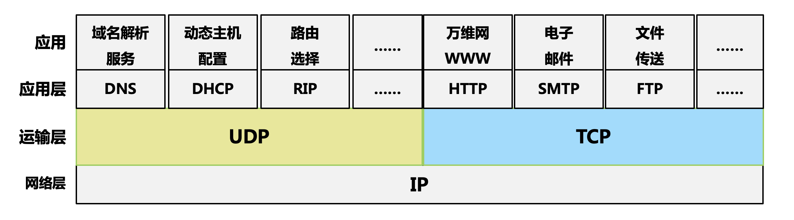

##### 3.传输层端口

端口用一个 16 位**端口号**进行标志，允许 **65535** 个不同端口。端口号只具有本地意义，即**端口号只是为了标识本计算机应用层中的各进程**。 不同计算机的相同端口号是**没有联系**的。两个计算机中的**进程**要互相通信，必须知道对方的 IP 地址以找到对方的计算机，而且还要知道对方的端口号以找到对方计算机中的**应用进程**。

端口用处及区间划分如下。

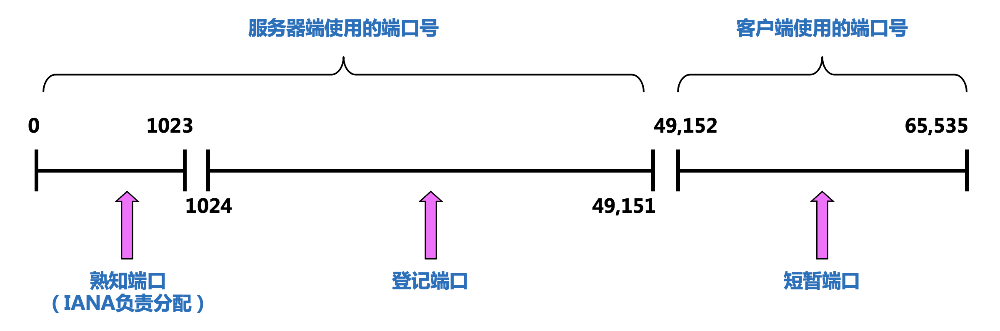

#### 用户数据报协议UDP

##### 1.概述

**用户数据报协议 UDP **是**无连接**的，它在 IP 层的数据报服务上只增加了：复用和分用的功能、差错检测的功能。 

当运输层从 IP 层收到 UDP 数据报时，就根据**首部**中的**目的端口**，把 UDP 数据报通过相应的端口上交至相应的应用进程。如果接收方 UDP 发现收到的报文中的目的端口**不正确**，即不存在对应端口的进程，就丢弃该报文，并由**==网际控制报文协议 ICMP==** 发送 "端口不可达" 差错报文给发送方！！ 

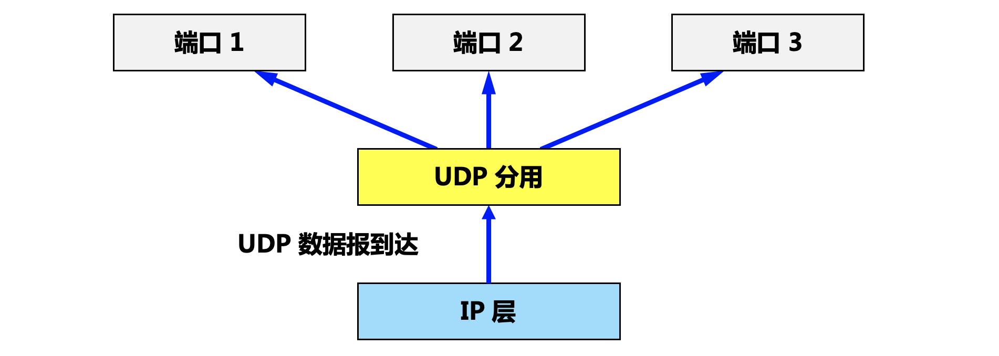

**注意**，虽然在 UDP 之间的通信要用到端口号，但**由于 UDP 的通信是无连接的，因此==不需要使用套接字==**。 

##### 2.UDP协议首部格式

用户数据报 UDP 有两个字段：**数据字段和首部字段**。首部很简单只有 **8 个字节**。四个字段的长度都是 2 字节。

- **源端口**：需要对方回信时使用，不需要时可用全 0。
- **目的端口**
- **长度**：UDP 数据报的长度，最小值是仅有首部时的 8。
- **校验和**：检验传输是否出错，出错丢弃。UDP 的校验和是把**首部和数据部分一起校验**。12 字节的伪首部是为了计算检验和临时添加的。

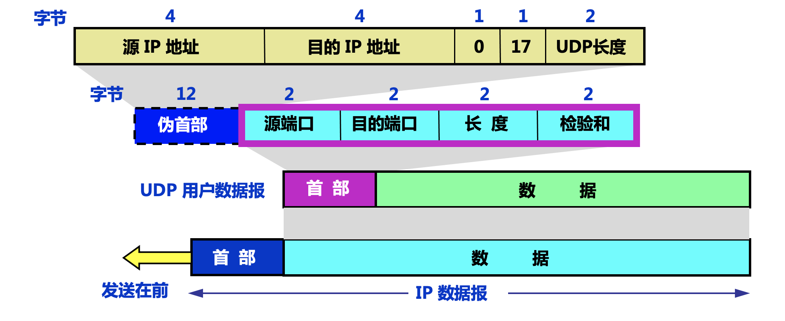

注意是**不含 IP 地址**的。

##### 3.UDP协议特点

(1) **UDP 是无连接的**，发送数据之前不需要建立连接，因此减少了开销和发送数据之前的时延。

(2) **UDP 使用尽最大努力交付，即不保证可靠交付**，因此主机不需要维持复杂的连接状态表。 

(3) **UDP 是面向报文的**。UDP 对应用层交下来的报文，既不合并也不拆分，而是保留这些报文的边界。UDP 一次交付一个完整的报文，如下图。

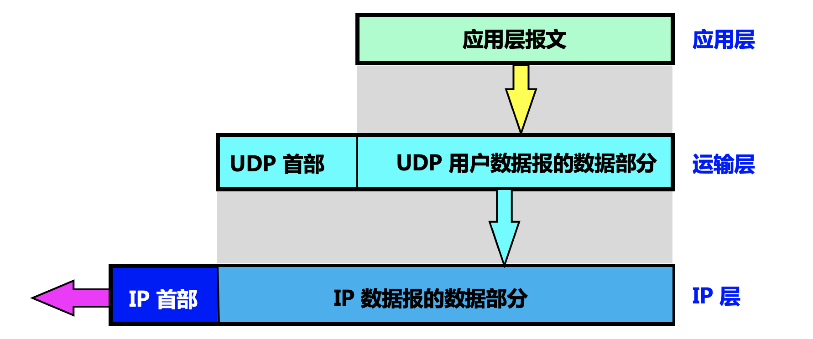

(4) **UDP ==没有拥塞控制==**，因此网络出现的拥塞**不会**使源主机的发送速率降低。这对某些**实时应用**是很重要的，如多媒体通信。

(5) **UDP 支持一对一、一对多、多对一和多对多的交互通信**。 

(6) **UDP 的首部开销小**，只有 8 个字节，比 TCP 的 20 个字节的首部要短。 

##### 4.UDP可靠传输

这是一个常考的面试题。使用 UDP 的传输层无法保证数据的可靠传输时，只能**通过应用层**来实现了。实现的方式可以参照 TCP 可靠性传输的方式，只是实现不在传输层，而是转移到了应用层。主要方式：

- 添加 **seq/ack 机制**，确保数据发送到对端。
- 添加发送和**接收缓冲区**，配合**超时重传机制**进行丢失数据的重传。

相关的协议：

- **RUDP**：提供一组数据服务质量增强机制，如拥塞控制的改进、重发机制及淡化服务器算法等，从而在包丢失和网络拥塞的情况下，RTP 客户机(实时位置)面前呈现的就是一个高质量的 RTP 流。
- **RTP**：为数据提供了具有实时特征的端对端传送服务，如在组播或单播网络服务下的交互式视频音频或模拟数据。
- **UDT**：UDT 建于 UDP 之上，并引入新的拥塞控制和数据可靠性控制机制。UDT 是**面向连接的双向的应用层协议**。它同时支持可靠的数据流传输和部分可靠的数据报传输。

#### 传输控制协议TCP

##### 1.概述

**传输控制协议TCP**是**面向连接的传输层协议**，**每一条 TCP 连接只能有两个端点**(endpoint)，**每一条 TCP 连接只能是点对点**(一对一)的。 TCP 提供**全双工通信**、**面向字节流的可靠交付的服务**。

TCP 中的 "流" 指的是流入或流出进程的字节序列。"面向字节流" 的含义是：虽然应用程序和 TCP 的交互是一次一个**数据块**，但 TCP 把应用程序交下来的数据看成是一连串无结构的**字节流**，如下图。

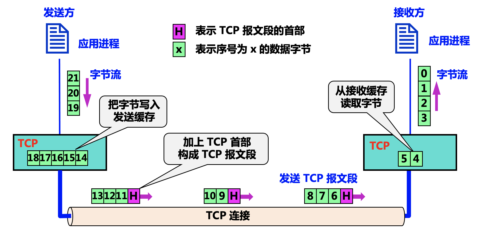

**TCP 连接是一条虚连接而不是一条真正的物理连接**。每一条 TCP 连接有 2 个端点，TCP 连接的**端点**叫做**套接字(socket)**。**端口号拼接到 IP 地**址即构成了**套接字**。

```http
套接字 socket = (IP地址 : 端口号)
```

**每一条 TCP 连接被通信两端的两个套接字所确定**。即：

```http
TCP连接 ::= {socket1, socket2} = {(IP1:port1), (IP2:port2)}
```

同一个 **IP 地址**可以有多个**不同的 TCP 连接**，而**同一个端口号**也可以出现在**多个不同的 TCP 连接**中。

##### 2.TCP报文格式

TCP 虽然是面向**字节流**的，但传送的数据单元却是**报文段**。一个 TCP 报文段分为**首部和数据**两部分，而 TCP 的全部功能都体现在它首部中各字段的作用。TCP 报文作为 **IP 数据报**的数据部分。

TCP 报文段首部的**前 20** 个字节是**固定**的，后面有 4N 字节是根据需要而增加的选项(N 是整数)。因此 TCP 首部的最小长度是 **20 字节**。

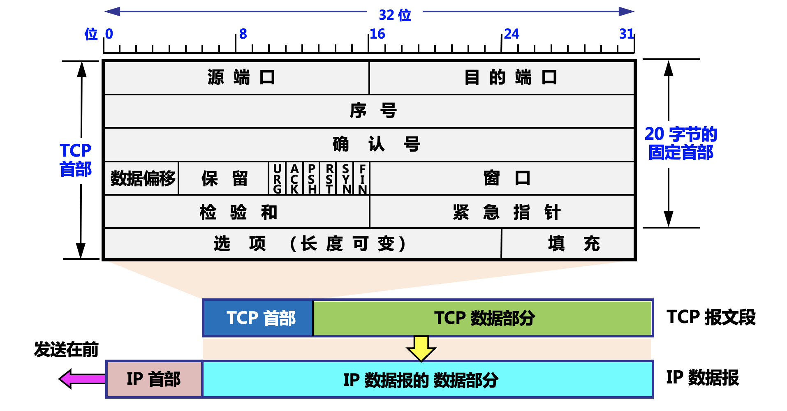

- **==源端口和目的端口==**：各占 **2 字节**。端口是运输层与应用层的服务接口，传输层的**复用和分用**功能都要通过端口才能实现。 
- **==序号 seq==**：占 **4 字节**。TCP 连接中传送的数据流中的**每一个字节**都有一个**序号**。序号字段的值则指的是**本报文段**所**发送的**数据的**第一个字节**的序号。 

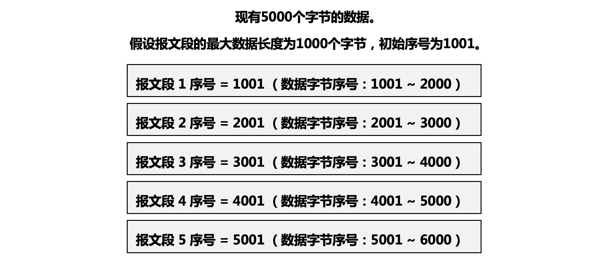

- **==确认号 ack==**：占 4 字节，是**==期望==**收到**对方**的**下一个报文段**的数据的**第一个字节**序号。若确认号 **ack = N**，则表明到序号 **N - 1** 为止的所有数据都**已正确收到**。

- **数据偏移**：即**首部长度**。占 4 位，它指出当前 TCP 报文段的**数据起始处**距离 TCP 报文段的起始处有多远。"数据偏移" 的单位是 32 位字(以 4 字节为计算单位)。 
- **保留**：占 6 位，保留为今后使用，但目前应置为 0。
- **紧急 URG**：当 URG = 1 时，表明紧急指针字段**有效**。它告诉系统此报文段中有紧急数据，应尽快传送(相当于高优先级的数据)。 
- **==确认 ACK 标志位==**：只有当 **ACK = 1** 时**确认号字段才有效**。当 ACK = 0 时，确认号无效。 
- **推送 PSH**：接收 TCP 收到 PSH = 1 的报文段，就尽快地交付接收应用进程，而不再等到整个缓存都填满了后再向上交付。 
- **复位 RST**：当 RST = 1 时，表明 TCP 连接中如由于主机崩溃或其他原因出现严重差错而必须释放连接，然后再重新建立运输连接。 
- ==**同步 SYN 标志位**==(**Syn**chronize Sequence Numbers)：同步 **SYN = 1** 表示这是一个==**连接请求或连接接受**==报文，在**连接时**用来**同步序号**。   
- **==终止 FIN 标志位==**：用来**释放**一个连接。**FIN = 1** 表明此报文段的**发送端**的数据已**发送完毕**，并**要求释放连接**。 
- **==窗口==**：占 2 字节，是用来**对方设置**发送窗口大小的依据，单位为字节。窗口字段明确指出了现在**允许对方发送**的数据量，窗口值常在**动态**变化着。TCP 根据对方给出**的窗口值**和当前**网络拥塞的程度**来决定一个报文段应**包含多少个字节**(UDP 发送的报文**长度是应用进程给出**的)。TCP 并不关心应用进程一次把多长的报文发送到 TCP 的缓存中，而是根据**对方给出的窗口值**和当前网络拥塞的程序来决定一个报文段应该包含多少个字节。如果缓存的数据块太长可以划分短一些再传送。
- **校验和**：占 2 字节。检验和字段检验的范围包括**首部和数据**这两部分。在计算检验和时，临时在 TCP 报文段的前面加上 12 字节的伪首部。
- **紧急指针字段**：占 16 位，指出在本报文段中紧急数据共有多少个字节。 
- **选项**：长度可变。TCP 最初只规定了一种选项，即**最大报文段长度 MSS**。MSS 告诉对方 TCP：我的缓存所能接收的报文段的数据字段的最大长度是 MSS 个字节。
- **填充**：使整个首部长度是 **4 字节**的**整数倍**。

#### TCP可靠传输的工作原理

**IP** **网络**所提供的是**不可靠**的传输，TCP 为了实现可靠传输需要一些特定功能，主要有**停止等待协议**、**连续 ARQ 协议、滑动窗口协议(TCP协议的精髓)**。

==**注意关系**==：ARQ 协议是**自动重传请求**(Automatic Repeat-reQuest)。包含**停止等待 ARQ**(信道利用率低) 和**连续 ARQ**(信道利用率高)，**ARQ** 协议实现**连续发送**是**基于滑动窗口协议**的。除此之外滑动窗口还可以用于**流量控制**。

#### ARQ协议

ARQ 协议的核心就是**自动请求重传**。**自动重传请求**(Automatic Repeat-reQuest，ARQ) 是 OSI 模型中数据链路层和传输层的错误纠正协议之一。它通过使用**确认和超时**这两个机制，在不可靠服务的基础上实现可靠的信息传输。如果发送方在发送后一段时间之内没有收到确认帧，它通常会重新发送。**ARQ 包括停止等待 ARQ 协议和连续 ARQ 协议**。

##### 1.停止等待ARQ协议

**停止等待协议的要点就是对每个分组都进行编号，且每发送完一个分组就停止发送，等待对方的确认。在收到确认后再发送下一个分组**。发送方为**每个发送的分组**设置一个**超时计时器**。若超时计时器超时，发送方会**自动重传**分组。虽然该协议简单但是信道利用率太低。

协议工作时可能会遇到几种情况。

###### (1)无差错情况

发送方发送分组，接收方在规定时间内收到，并且回复确认。发送方可再次发送分组，这就是无差错的**正常情况**。

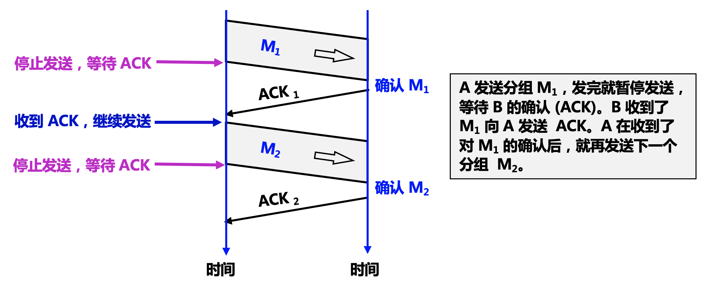

###### (2)出现差错

如果 B 接收 M1 分组后进行**校验**出了差错，就会直接**丢弃 M1**，其他什么也不做，**不通知** A 收到有差错的分组。且如果分组 M1 在**传输过程中丢失**了，接收方 B 什么都不能做。在这两种情况下，B 都**不会回复**任何信息。但 A 都必须**重发分组**，直到 **B 正确接收**为止，这样才能实现可靠通信。

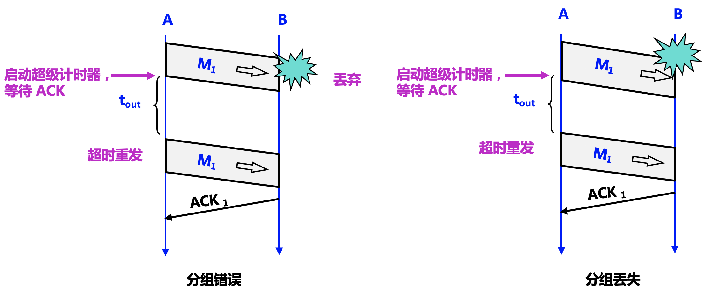

> **A 如何知道 B 是否正确收到了 M1 分组？**

**解决方法：超时重传**

A 为**每一个已发送的分组**都设置了一个**超时计时器**。A 只要在超时计时器**到期**之前收到了相应的**确认**，就**撤销**该超时计时器，继续发送下一个分组 M2。若 A 在超时计时器规定时间内没有收到 B 的确认，就认为分组错误或丢失，就**重发该分组**。

> **若分组正确到达 B，但 B 回送的确认丢失或延迟了，A 未收到 B 的确认，会超时重发。B 可能会收到重复的 M1 。B 如何知道收到了重复的分组，需要丢弃呢？**

**解决方法：编号**

A 为**每一个发送的分组**都进行**编号**。若 B 收到了编号**相同的分组**，则认为收到了重复分组，**丢弃重复的分组**，并**回送确认**。B 为发送的确认也进行**编号**，指示该确认是对**哪一个分组的确认**。A 根据确认及其编号，可以确定它是对哪一个分组的确认，避免重发发送。若为重复的确认，则将其**丢弃**。

###### (3)确认丢失

若 B 所发送的对 M1 的**确认信息丢失**了，那么 A 在设定的超时重传时间内不能收到确认，但 A 并**无法知道**：是自己发送的分组出错、丢失了，还是 B 发送的确认丢失了。因此 A 在超时计时器到期后就要**重传** M1。

假定此时 B 又收到了重传的分组 M1。这时 B 应采取**两个行动**：第一，**丢弃这个重复**的分组 M1，不向上层交付。第二，向 A **发送确认**。**不能认为已经发送过确认就不再发送**，因为 A 之所以重传 M1 就表示 A 没有收到对 M1 的确认。

###### (4)确认迟到

如果传输过程中没有出现差错，但 B 对分组 M1 的**确认因网络阻塞等原因迟到**了。B 仍然会收到**重复的 M1**，并且同样要**丢弃**重复的 M1，并**重传确认分组**。此时 A 会收到**重复的确认**。A 也会丢弃掉收到的重复确认。

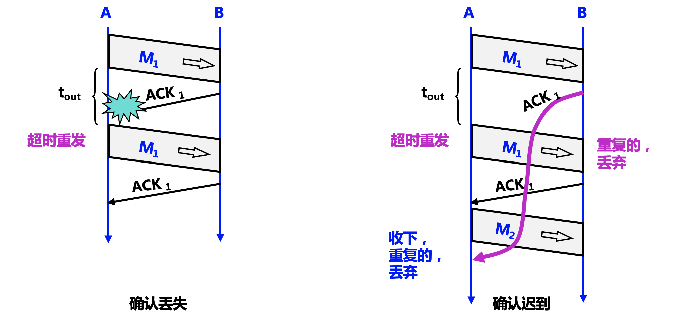

注意：

- 在发送完一个分组后，必须**暂时保留**已发送的分组的**副本**，以备**重发**。
- **分组和确认分组都必须进行编号**。
- 超时计时器的重传时间应当比数据在分组传输的平均往返时间更长一些。 

###### (5)信道利用率

当往返时间 RTT 远大于分组发送时间 TD 时，信道的利用率就会**非常低**。若出现超时重传，则对传送有用的数据信息来说，信道的利用率就还要降低。

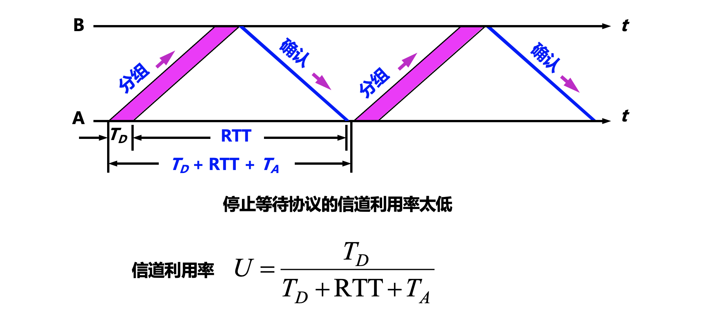

##### 2.自动请求重传协议

通常发送方最终总是可以收到对所有发出分组的**确认**。如果发送方**不断重传**分组但总是收不到确认，就说明通信**线路太差**，不能进行通信。使用**上述的确认和重传机制，就可以在==不可靠的传输网络上实现可靠的通信==。**像上述的**这种可靠传输协议**常称为==**自动重传请求 ARQ**==  (Automatic Repeat Request)。**意思是重传的请求是自动进行的，接收方不需要请求发送方重传某个出错的分组。**

上面的停止等待 ARQ 协议就是自动请求重传协议的一种。

##### 3.流水线传输

为提高传输效率，发送方可以采用**流水线传输**。流水线传输就是**发送方可连续发送多个分组**，不必每发完一个分组就停顿下来等待对方的确认。这样可使信道上一直有数据不间断地传送，这种传输方式可获得很高的**信道利用率**。 

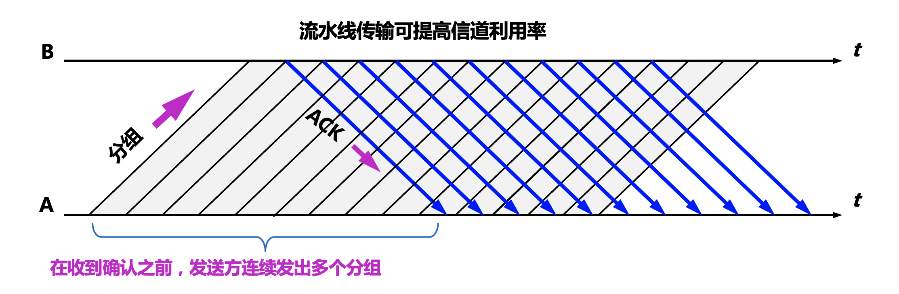

这就**演变**出来**连续 ARQ 协议**。

##### 4.连续ARQ协议

要点：**自动请求重传(ARQ) + 流水线**。

连续 ARQ 协议就是在停止等待 ARQ 协议的基础上，发送方一次可以发出**多个分组**。同时使用**滑动窗口协议**控制发送方和接收方所能发送和接收的分组的**数量和编号**。发送方每收到一个确认，就把发送窗口向前滑动。**接收方**一般采用**累积确认**的方式。不必对分组逐个确认，而可以对按序到达的**最后一个分组**进行确认表示到这个分组为止的所有分组**都已正确**收到了。**超时重传**则采用**回退 N**(Go-Back-N) 方法进行。如果发送方发送了前 5 个分组，而中间的第 3 个分组丢失了。这时接收方只能对**前两个**分组发出确认。发送方无法知道后面三个分组的下落，而只好把后面的三个分组**都再重传**一次。这就叫做回退 N，表示需要**再退回来重传已发送过的 N 个分组**。

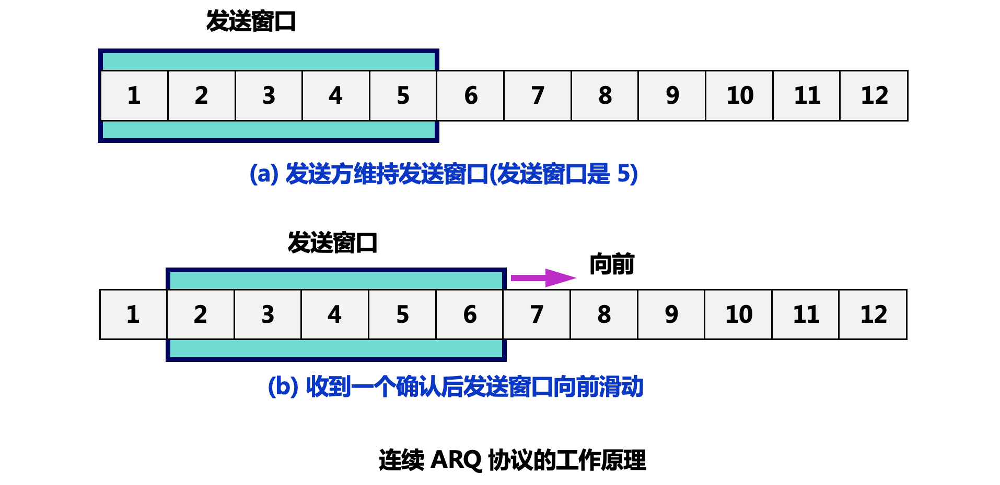

连续 ARQ 协议是**基于滑动窗口协议**的。下面看看滑动窗口协议。

#### TCP可靠传输实现

上一节讲的是实现可靠传输的**基本原理**，这一节具体讲 TCP 是如何实现可靠传输的。分为三个部分。

##### 1.滑动窗口协议

**滑动窗口协议**在在发送方和接收方之间各自维持一个**滑动窗口**，发送方是**发送窗口**，接收方是**接收窗口**，而且这个窗口是可以随着时间变化向前**滑动**的。它允许发送方**发送多个分组**而不需等待确认，提高了信道利用率。

###### (1)基本流程

窗口是**缓存**的一部分，用来暂时存放**字节流**。发送方和接收方各有一个窗口，**接收方**通过 TCP 报文段中的**窗口字段**告诉发送方自己的窗口大小，发送方根据这个值和其它信息**设置自己的窗口大小**。滑动窗口以**字节**为单位。

**发送窗口**内的字节都**允许被发送**，**接收窗口**内的字节都**允许被接收**。如果发送窗口左边的字节已经发送并且**收到了确认**，那么就将发送窗口向**右滑动**一定距离，直到左部第一个字节不是已发送**并且已确认**的状态；接收窗口的滑动类似，接收窗口左部字节已经发送**确认**并交付主机，就向**右滑动**接收窗口。

- **发送窗口**表示：即使在**没有收到确认**的情况下，也可以**连续把窗口内的数据**全部发送出去。
- **接收窗口**表示：**只允许**接收**落入窗口内**的数据。

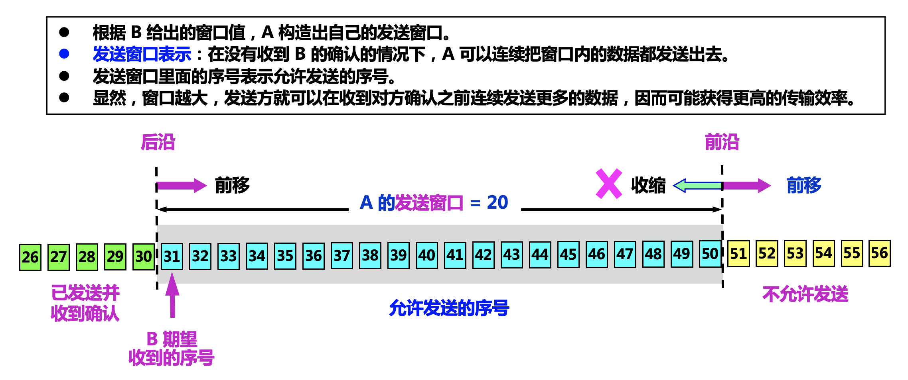

发送窗口里面的序号 **31 - 50** 表示是**允许发送**的序号。发送窗口后沿的后面部分表示已经收到**并且确认**，这部分数据**不需要**继续保存。描述一个发送窗口需要维护**三个指针**，如下图所示。下图中如果 **B 收到了 32、33** 序号的数据，但是并**没有收到 31** 的数据，说明数据**没有按序到达**，所以 B 发送的确认报文段中的**确认号**仍然是 **31**，即**期望收到**的序号。

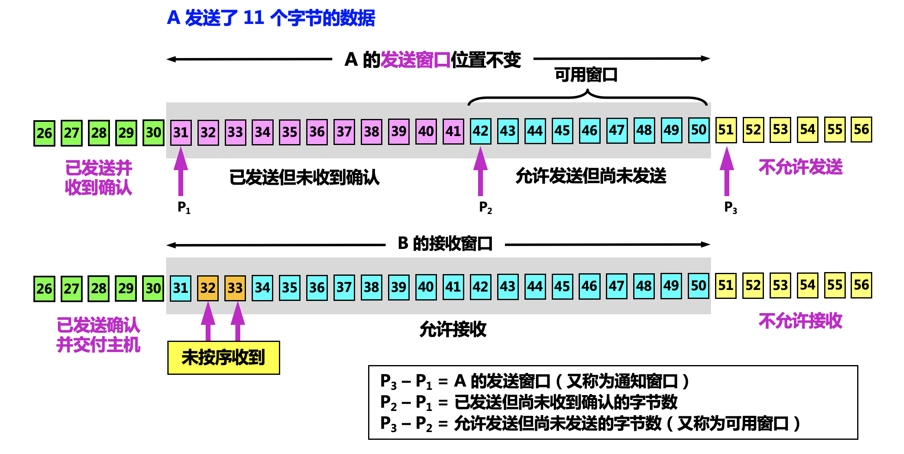

下图所示为 B **收到** 31-33 的数据并交付主机，同时给 A 确认，其中**窗口值为 20** ，**确认值**变为 **34**，即**下一个期望**收到序号为 34 的数据。同时下图还收到了 37、38、40 序号的数据，但是**未按序到达**，所以只是**暂存**到接收窗口。此时 B 的**接收窗口向前滑动**到下一个期待接收的位置依然是 34。

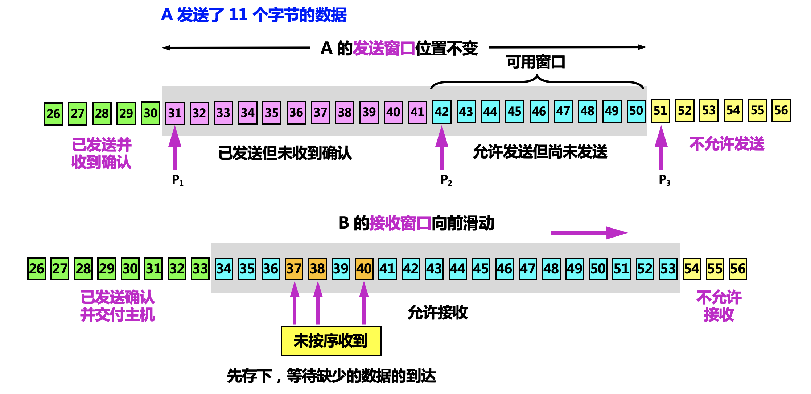

此时 A 收到确认号，**发送窗口向前滑动**。

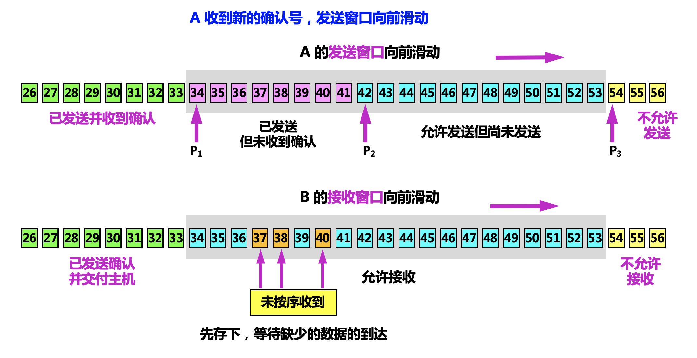

如果 A 的发送窗口内的**序号都已用完**，但还**没有**再收到确认，必须**停止发送**。如下图。

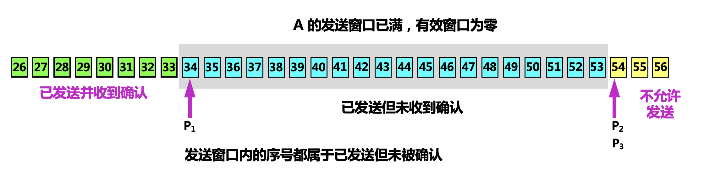

而如果 A 收到确认落在发送窗口内，那就可以使发送窗口继续**向前滑动**。

注意：

- 发送端的发送窗口**并不总是**和 B 的接收窗口一样大，因为可能有一定的**时间滞后**。
- TCP 标准没有规定对不按序到达的数据应如何处理。通常是先**临时存放在接收窗口**中，等到字节流中所**缺少的字节收到**后，再按序交付上层的应用进程。
- TCP 要求接收方必须有**累积确认**的功能，这样可以减小传输**开销**。 
- 其实真正的发送窗口值的大小还取决于网络的**拥塞情况**，**发送窗口的上限值 = Min (接收方窗口值，拥塞窗口值)**。

###### (2)滑动窗口与缓存

**发送缓存**用来暂时发送方**准备发送**的数据，以及已发送但**尚未收到**确认的数据。

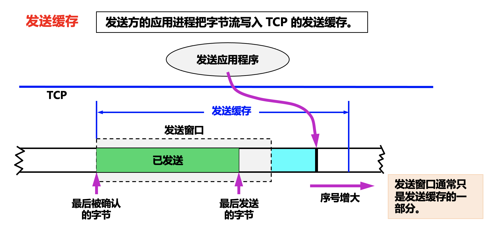

**接收缓存**用来暂时存放**按序到达**的、但尚未被接收应用程序读取的数据，以及**未按序**到达的数据。 

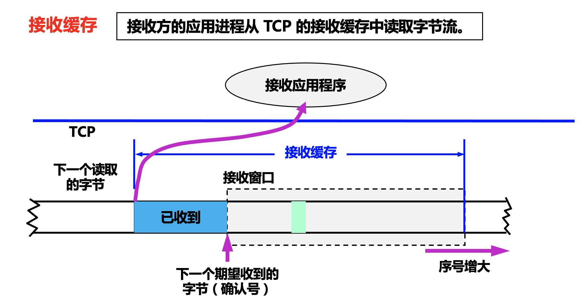

##### 2.超时重传时间

TCP 每发送一个报文段，就对这个报文段设置一次**计时器**。只要**计时器**设置的重传时间到但还没有收到确认，就要重传这一报文段。这里重传**时间的选择**很关键。如果把超时重传时间设置得**太短**，就会引起很多报文段的不必要的重传，使网络负荷增大；若设置得**过长**，则又使网络的空闲时间增大，降低了传输效率。

> **如何设置超时重传时间？**

TCP 采用了一种**自适应算法**，它记录一个报文段发出的时间，以及收到相应的确认的时间。这两个时间之差就是报文段的往返时间 **RTT**。计算**加权平均往返时间 RTTs**。超时重传时间 **RTO**(Retransmission Time-Out) 应**略大于**上面得出的加权平均往返时间 RTTs。

> **如何准确计算 RTTs?**

在计算平均往返时间 RTT 时，只要发生了报文段**重传**事件，就**不采用**其往返时间样本。这样得出的加权平均 RTTs 和 RTO 就比较准确。

##### 3.选择确认SACK

若收到的报文段无差错，只是**未按序号**，中间还**缺少**一些序号的数据，也可以采用选择确认 SACK(Selective ACK) 的方式只传送缺少的数据而不重传已经正确到达接收方的数据。但其实**大多数的实现**还是**重传所有**未被确认的数据块。

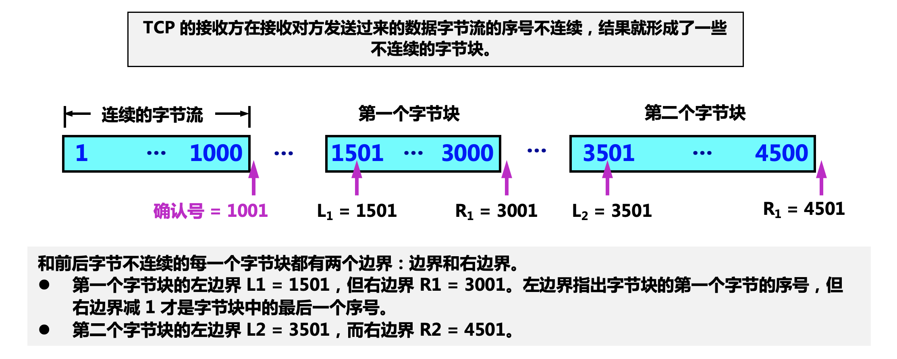

#### TCP流量控制

##### 1.概述

**流量控制**就是**控制发送方发送速率**，保证**接收方**来得及接收。**接收方**发送的**确认**报文中的**窗口字段**可以用来**控制发送方窗口值**大小(**利用滑动窗口实现流量控制**)，从而影响发送方的发送速率。将窗口字段设置为 **0**，则发送方**不能**发送数据。

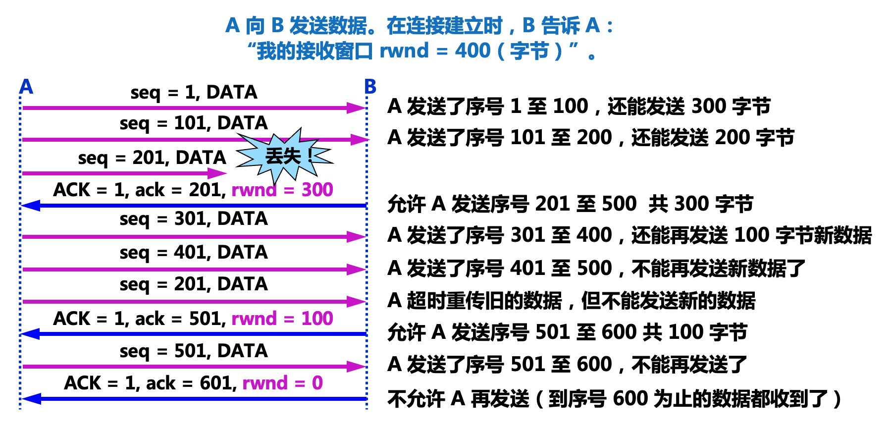

##### 2.可能发生死锁

B 向 A 发送了零窗口的报文段后不久，B 的接收**缓存**又有了一些**存储空间**。于是 B 向 A 发送了 rwnd = 400 的报文段。但这个报文段在传送过程中**丢失**了。A 一直等待收到 B 发送的**非零窗口**的通知，而 B 也一直等待 A 发送的数据。如果没有其他措施，这种**互相等待的死锁局面**将一直延续下去。为了解决这个问题，TCP 为**每一个连接**设有一个**持续计时器**(persistence timer)。

##### 3.持续计数器

只要 TCP 连接的一方收到对方的**零窗口**通知，就**启动该持续计时器**。若持续计时器设置的时间到期，就发送一个仅携带 1 字节的数据零窗口探测报文段，而对方就在确认这个探测报文段时给出了现在的窗口值。若窗口仍然是零，则收到这个报文段的一方就重新设置持续计时器。若窗口不是零，则死锁的僵局就可以打破了。

#### TCP拥塞控制

##### 1.概述

在某段时间，若对网络中某资源的需求超过了该资源所能提供的可用部分，网络的**性能**就要变坏，这种现象称为**拥塞**(congestion)。最坏可能导致系统崩溃。

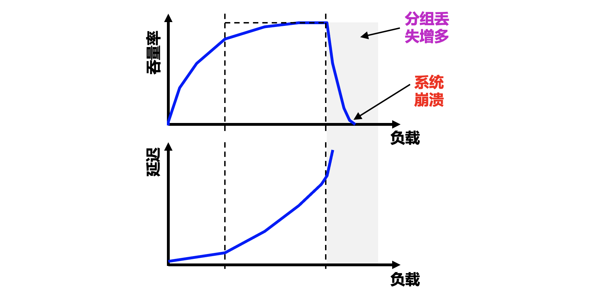

增加资源能解决拥塞吗？**不能**。网络拥塞往往是由**许多因素**引起的，简单地增加资源在许多情况下不但不能解决拥塞问题，而且还可能使网络的性能更坏。

**拥塞控制**所起的作用：

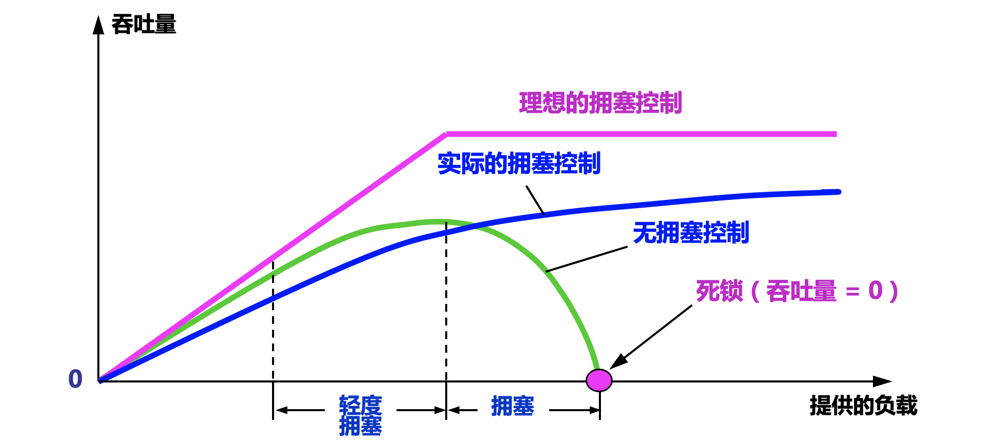

> **流量控制与拥塞控制的对比**

|                        流量控制                        |                           拥塞控制                           |
| :----------------------------------------------------: | :----------------------------------------------------------: |
| 抑制**发送端发**送数据的速率，以使接收端**来得及接收** | **防止**过多的数据**注入到网络**中，使网络中的路由器或链路**不致过载** |
|      是**点对点**通信量的控制，是**端到端**的问题      | 是一个**全局性**的过程，涉及到与降低网络传输性能有关的所有因素 |
|                  使用**滑动窗口**实现                  | 使用**拥塞窗口**变量 + **拥塞控制算法**实现，还要**配合滑动窗口** |

- **拥塞控制**是一个**全局性的过程**，涉及到所有主机、所有路由器的通信链路全局，以及与降低网络传输性能有关的所有因素。
- **流量控制**往往指在给定的发送端和接收端之间的**点对点**通信量的控制，只要通信双方进行协商即可。流量控制所要做的就是抑制发送端发送数据的速率，以便使接收端来得及接收。 
- 流量控制需要通信双方各维护一个发送窗、一个接收窗，对任意一方，接收窗大小由自身决定，发送窗大小由接收方响应的 TCP 报文段中窗口值确定；拥塞控制的拥塞窗口大小变化由试探性发送一定数据量数据探查网络状况后而自适应调整。
- **发送方实际最终发送窗口 = min{流控发送窗口，拥塞窗口}。**

> **滑动窗口与拥塞窗口的区别**

**滑动窗口**是接收窗口，就是 TCP 头的那个**窗口**，可以理解为一块**内存**，不仅要接收数据，还要向应用层交付数据。而拥塞窗口是一个**变量**。

##### 2.TCP拥塞控制方法

**拥塞控制**：基于**拥塞窗口变量 + 几种拥塞控制算法**实现。

- TCP 采用**基于拥塞窗口**的方法进行拥塞控制，该方法属于闭环控制方法。TCP**发送方**维持一个**拥塞窗口 ==cwnd==**(Congestion Window) 的变量。**发送端**利用**拥塞窗口**根据网络的拥塞情况**调整发送的数据量**。
- **发送窗口大小**不仅取决于**接收方窗口**(就是 TCP 头部中的窗口值)，还取决于网络的**拥塞状况**，所以真正的**发送窗口值**为：

```
发送窗口的上限值 = Min (接收方窗口值，拥塞窗口值) = Min(rwnd, cwnd)
```

- 当 rwnd < cwnd 时，是**接收方**的接收能力限制发送窗口的**最大值**。
- 当 cwnd < rwnd 时，则是网络的**拥塞限制**发送窗口的**最大值**。 

即发送方让自己的**发送窗口**取为**拥塞窗口和接收方的接受窗口**中**较小的一个**。

**控制拥塞窗口的原则**：只要网络**没有**出现拥塞，拥塞窗口就可以再**增大**一些，以便把更多的分组发送出去，这样就可以提高网络的利用率。但只要网络**出现**拥塞或有可能出现拥塞，就必须把拥塞窗口**减小**一些，以减少注入到网络中的分组数，以便缓解网络出现的拥塞。

**拥塞的判断**：

- **收到三个重复的** **ACK**：预示网络可能会出现拥塞，实际可能还未发生拥塞。
- **重传定时器超时**：网络已经发生了拥塞。

##### 3.TCP拥塞控制算法

四种拥塞控制算法：

- **慢开始**(slow-start)
- **拥塞避免**(congestion avoidance)
- **快重传**(fast retransmit)
- **快恢复**(fast recovery)

TCP 拥塞控制流程图。

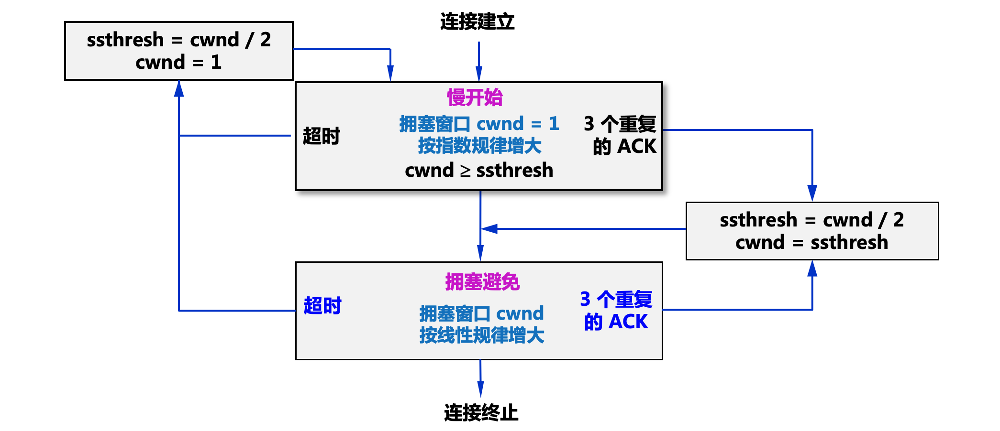

###### (1)慢开始算法

**目的**：用来确定网络的**负载能力**或拥塞程度。

**算法思路**：由小到大**逐渐**增大拥塞窗口数值。

两个变量：

（1）**拥塞窗口**：**初始**拥塞窗口值。**2 - 4** 个最大报文段，窗口值逐渐增大。

（2）**慢开始门限**(**ssthresh**)：防止拥塞窗口增长过大引起网络拥塞。

**拥塞窗口 cwnd 控制方法**：在每收到一个对**新的报文段的确认**后，可以把拥塞窗口**增加最多一个** **SMSS** 的数值。

发送方**每收到**一个对新**报文段**的确认(重传的不算在内)就使 cwnd 加 1，如果一个轮次传了 4 个报文段，那么等这 4 个都收到确认之后，窗口值就会多出 4 个，整体表现就是一个轮次后变成了原来的两倍。

每经过一个**传输轮次**，拥塞窗口值就**加倍**，即 ==**cwnd = cwnd \* 2**==。一个传输轮次所经历的时间其实就是**往返时间 RTT**。**"传输轮次"** 强调的是把拥塞窗口 cwnd 所允许发送的报文段**都连续发送**出去，并收到了对**已发送**的**最后一个字节**的确认。例如拥塞窗口 cwnd = 4，这时的往返时间 RTT 就是发送方**连续发送 4 个报文段**，并收到这全部 **4 个报文段**的确认，总共经历的时间。

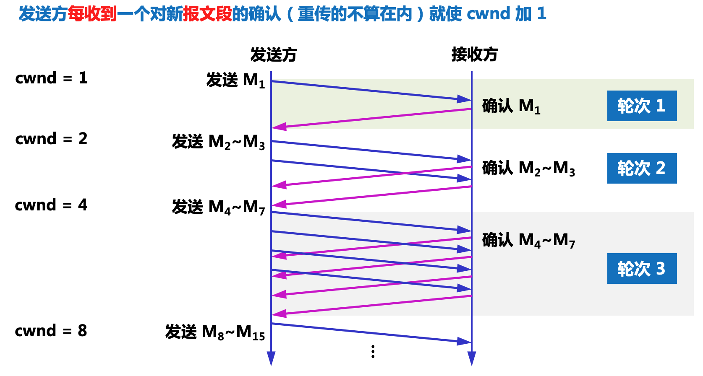

**设置慢开始门限状态变量 ssthresh**。**慢开始门限 ssthresh** 的用法如下：

- 当 **cwnd < ssthresh** 时，使用**慢开始**算法。
- 当 **cwnd > ssthresh** 时，停止使用慢开始算法而改用**拥塞避免算法**。
- 当 **cwnd = ssthresh** 时，既可使用慢开始算法，也可使用拥塞避免算法。

###### (2)拥塞避免算法

当 **==cwnd > ssthresh==** 时，停止使用慢开始算法而改用**拥塞避免算法**。

**思路**：让拥塞窗口 cwnd **缓慢地增大**，避免出现拥塞。**超时之前**，每经过一个**传输轮次**(注意慢开始算法是每收到一个报文段就加 1)，拥塞窗口 **==cwnd = cwnd + 1==**。这就使拥塞窗口 cwnd 按**线性规律缓慢增长**。在拥塞避免阶段，具有 "**加法增大**" 的特点。

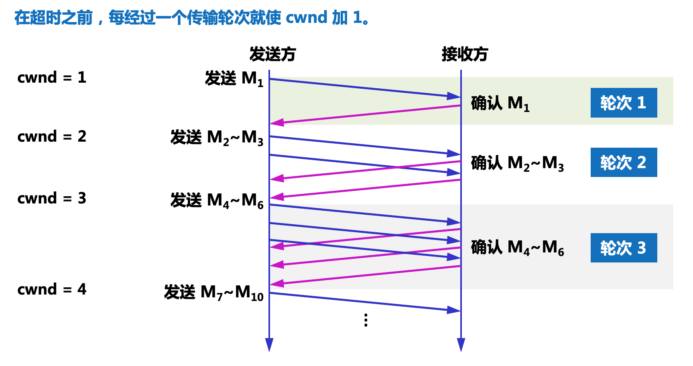

当网络**出现拥塞**时：无论在慢开始阶段还是在拥塞避免阶段，只要发送方判断网络出现拥塞(重传定时器超时)，就执行如下操作：

**(1) ssthresh = max(cwnd / 2，2)**：**降低门限值(取一半)**。

**(2) cwnd = 1**：拥塞窗口**重新变为 1**。

**(3) 执行慢开始算法**：重新执行**慢开始**。

目的：**迅速**减少主机发送到网络中的分组数，使得发生拥塞的路由器有足够时间把队列中积压的分组**处理完毕**。"拥塞避免" **并非指完全**能够避免了拥塞，利用以上的措施要完全避免网络拥塞还是不可能的。"**拥塞避免**" 是说在拥塞避免阶段把拥塞窗口**控制为按线性规律增长**，使网络比较**不容易**出现拥塞。

**慢开始与拥塞避免算法的过程举例：**

- 当 TCP 连接进行初始化时，将拥塞窗口置为 1。图中的窗口单位不使用字节而使用**报文段**。慢开始门限的初始值设置为 16 个报文段，即 ssthresh = 16。

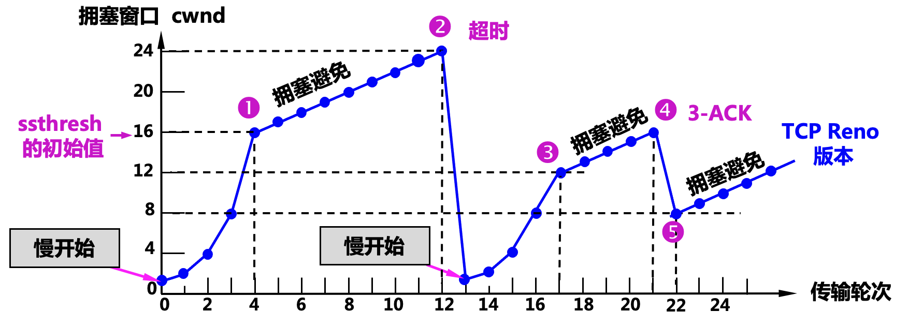

- 在执行慢开始算法时，拥塞窗口 **cwnd = 1**，发送第一个报文段。

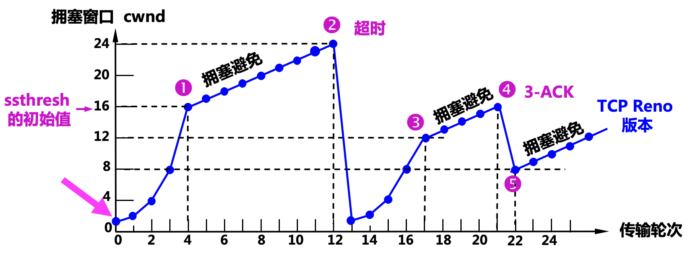

- 发送方**每收到一个**对新**报文段**的确认 ACK，就把拥塞窗口值加 1，然后开始下一轮的传输，注意横坐标是**传输轮次**，不是时间。因此拥塞窗口 cwnd 随着传输轮次按**指数规律增长**。

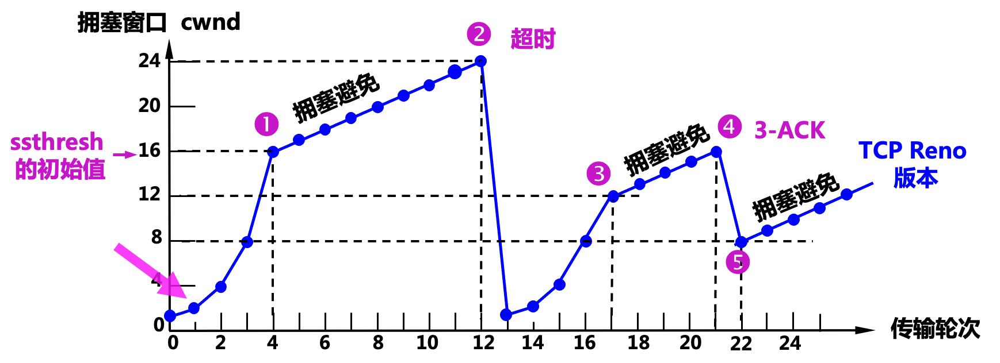

- 当拥塞窗口 cwnd 增长到慢开始门限值 ssthresh 时，即图中的点 ①。此时拥塞窗口 cwnd = 16，就改为执行**拥塞避免算法**，拥塞窗口按**线性规律增长**。

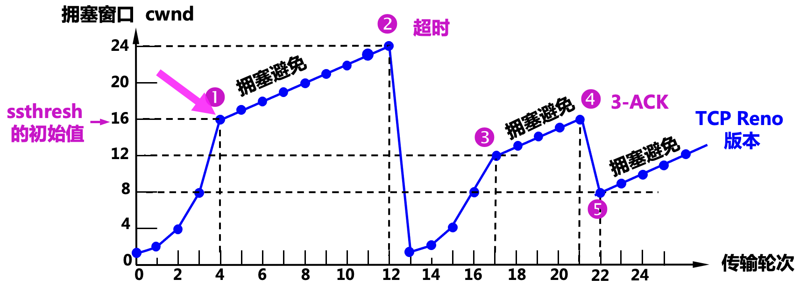

- 当拥塞窗口 cwnd = 24 时，网络出现了超时(图中的点 ②)，发送方判断为网络拥塞。于是调整门限值 ssthresh = cwnd / 2 = 12，同时重新设置拥塞窗口 cwnd = 1，进入**慢开始**阶段。

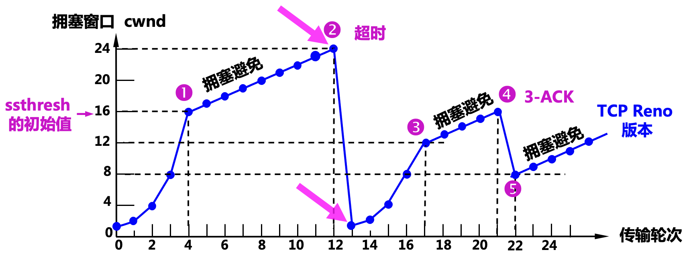

- 按照慢开始算法，发送方每收到一个对新**报文段**的确认 ACK，就把拥塞窗口值加 1。当拥塞窗口 cwnd = ssthresh = 12 时，即图中的点 ③，这是新的 ssthresh 值，改为执行拥塞避免算法，拥塞窗口按线性规律增大。

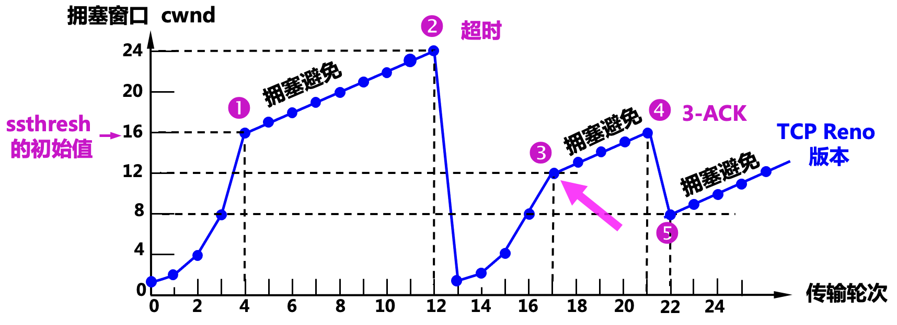

- 当拥塞窗口 cwnd = 16 时(图中的点 ④)，出现了一个新的情况，就是发送方一连收到 3 个对**同一个报文段的重复确认**，图中记为 3-ACK。发送方改为执行快重传和快恢复算法。

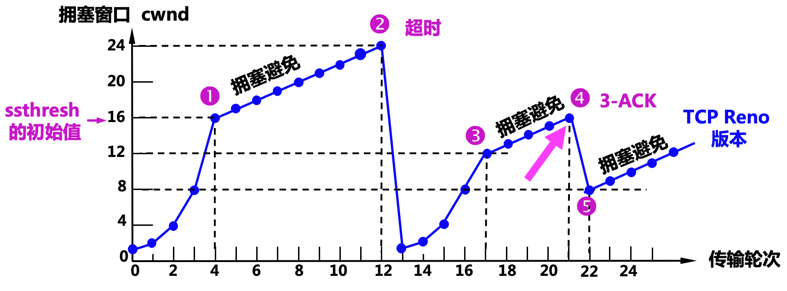

###### (3)快重传算法

**发送方**只要一连收到**三个重复确认**，就知道接收方确实**没有收到**报文段，因而应当**立即进行重传**，即 "**快重传**"，这样就**不会出现超时**，发送方也不就会误认为出现了网络拥塞。使用快重传可以使整个网络的**吞吐量**提高约 20%。不难看出，快重传并非取消重传计时器，而是在某些情况下可以**更早地(更快地)重传**丢失的报文段。

采用**快重传 FR**(Fast Retransmission) 算法可以让**发送方**尽早知道发生了个别报文段的丢失。快重传算法首先要求接收方**不要等待**自己发送数据时才进行捎带确认，而是要**立即发送确认**，即使收到了**失序**的报文段也要**立即**发出对已收到的报文段的**重复确认**。

下图中**仅仅是丢失了 M3**，其实**并没有发生拥塞**。此时**连续收**到其他三个**重复确认**，就说明其实网络**大概率没有拥塞**，而仅仅是发生了 M3 的丢失。此时启用快重传立即重传 M3。

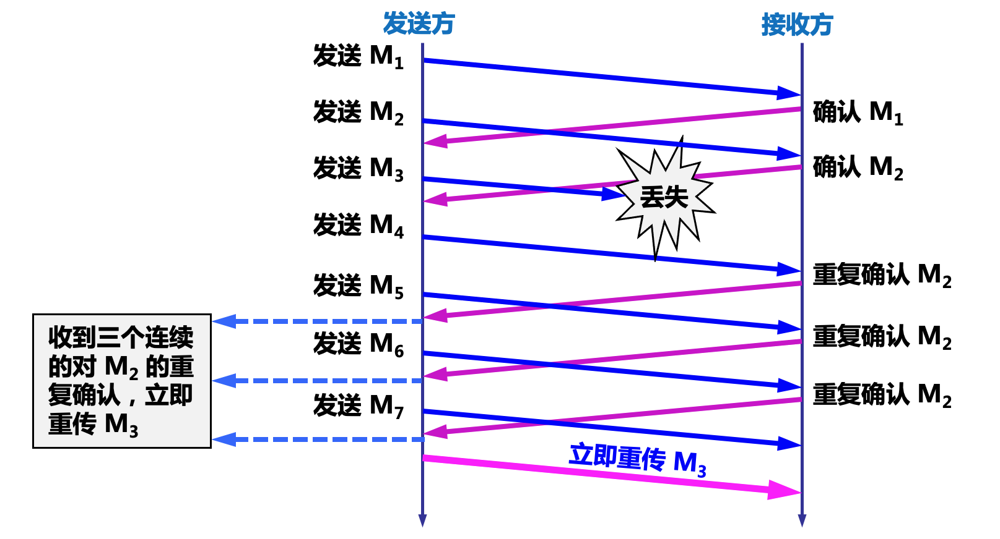

###### (4)快恢复算法

根据上图所示。当发送端收到连续**三个重复的确认**时，由于发送方现在认为网络**很可能没有发生拥塞**，因此现在**不需要**执行慢开始算法，而是执行**快恢复算法** FR(Fast Recovery) 算法：

**(1) 慢开始门限 ssthresh = 当前拥塞窗口 cwnd / 2;**

**(2) 新拥塞窗口 cwnd = 慢开始门限 ssthresh;**

**(3) 开始执行拥塞避免算法，使拥塞窗口缓慢地线性增大。**

因此在图的点 ④，发送方知道现在只是丢失了个别的报文段。于是不启动慢开始，而是执行**快恢复**算法。这时发送方调整门限值 ssthresh = cwnd / 2 = 8，同时设置拥塞窗口 cwnd = ssthresh = 8(见图中的点 ⑤)，并开始执行拥塞避免算法。

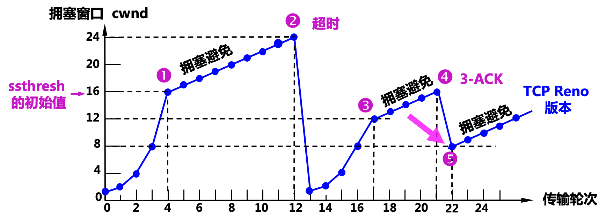

##### 4.AIMD

**拥塞避免算法**中，**拥塞窗口**是按照**线性规律**增大的。这常称为 "**加法增大**" AI(Additive Increase)。当出现超时或 3 个**重复的确认**时，就要把**门限值**设置为当前拥塞窗口值的**一半**，并大大减小拥塞窗口的数值这常称为 "**乘法减小**" MD(Multiplicative Decrease)。二者合在一起就是所谓的 **AIMD** 算法。

#### TCP建立连接

TCP 是**面向连接**的协议。TCP 传输数据有三个阶段：**连接建立**、**数据传送**、**连接释放**。TCP 连接的管理就是使 TCP 连接的**建立和释放**都能正常地进行。

##### 1.连接过程

TCP 连接建立过程中要解决三个问题：

- 要使每一方能够确知**对方的存在**。
- 要允许双方**协商一些参数**，如最大窗口值、是否使用窗口扩大选项和时间戳选项以及服务质量等。
- 能够对运输实体**资源**如缓存大小、连接表中的项目等进行**分配**。

TCP 建立连接的过程叫做**握手**。握手需要在客户和服务器之间**交换三个 TCP 报文段**，称之为**三报文握手/三次握手**。流程如下：

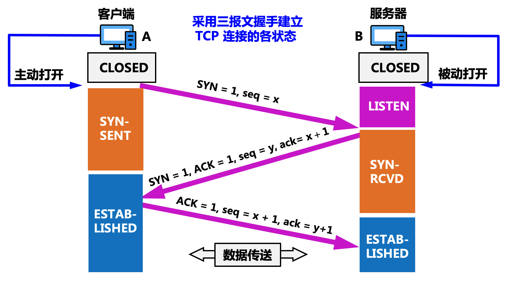

**第一次握手**：客户端发送连接请求，**SYN** 是**同步号**，**seq** 是数据的第一个**字节序号**，连接请求也有**数据**，只不过数据字节数**为 1**。TCP 连接是只有**客户端才能发起**。

**第二次握手**：服务器**收到**连接请求，**SYN 也为 1**。并使 **ACK = 1**，表示收到客户端的连接请求。只有当 **ACK = 1** 时**确认号 ack 字段才有效**。所以必须设置 ACK = 1。由于服务器收到客户端发送的序号 **seq = x**，说明服务器收到这一个字节的数据，因此期待客户端下一个发送的数据的第一个字节是 seq = **x + 1**。所以确认号 **ack = x + 1**。同时服务器也设置一个自己的序号 **seq = y**。

这里要注意**区分 ACK**(**标志位**，**为 1 时 ack 才有效**， ACK 表示回复对方**已经收到**对方的消息) 与 **ack**(**确认号**，用于确认已经收到数据，并且回复下一个期待收到的数据)。

**第三次握手**：客户端收到服务器的第二次握手，需要对服务器进行第三次握手，此时客户端回复 **ACK = 1**，表示收到服务端的第二次握手信息。由于之前客户端发送的是序列号 **seq = x**。而且服务端也发回来的确认号也是 x + 1。因此如果是正常的握手报文则客户端第三次握手的数据报文就是 **seq = x + 1**。同时客户端也收到服务器的 **seq = y**，需要确认收到了这个，因此回复给服务器的确认中确认号变为 **ack = y + 1**。

此时完成三次握手。之后进行数据传输。

简化流程，相当于客户端和服务端**都给**对方发送了 **SYN 和 ACK** 信号。

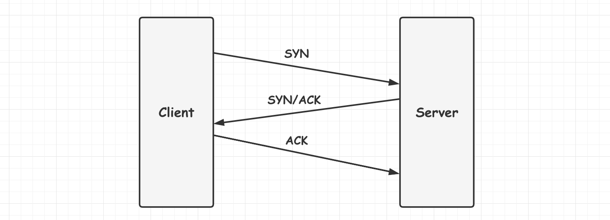

##### 2.三次握手的原因

> **为什么要进行第三次？只握手两次不行？**

**原因 1：三次握手最主要的目的就是双方确认自己与对方的发送与接收是正常的。**

- 第一次握手：Client 什么都不能确认；Server 确认了对方发送正常，自己接收正常。
- 第二次握手：Client 确认了：自己发送、接收正常，对方发送、接收正常；Server 确认了：对方发送正常，自己接收正常。
- 第三次握手：Client 确认了：自己发送、接收正常，对方发送、接收正常；Server 确认了：自己发送、接收正常，对方发送、接收正常。

**原因 2：进行第三次握手是为了防止失效的连接请求到达服务器，让服务器错误再次打开连接，占用服务器资源。**

客户端发送的连接请求如果在网络中**滞留**，那么就会隔很长一段时间才能收到服务器端发回的**连接确认**。客户端等待一个**超时重传**时间之后，就会**重新请求连接**。但是这个滞留的连接请求最后还是会到达服务器，如果不进行三次握手，那么服务器就会**打开两个连接**。如果有第三次握手，客户端会**忽略服务**器之后发送的对滞留连接请求的连接确认(因为序号这些对应不上)，不进行第三次握手，因此就不会再次打开连接。

> **为什么要传回SYN**

服务端传回发送端所发送的 **SYN 是为了告诉发送端**它接收到的信息确实就是客户端所发送的信号。SYN 是 TCP/IP 建立**连接时**使用的**握手信号**。在客户机和服务器之间建立正常的 TCP 网络连接时，客户机首先发出一个 **SYN 消息**，服务器使用 **SYN-ACK 应答**表示**接收到了这个消息**，最后客户机**再以 ACK** 消息响应。这样在客户机和服务器之间才能建立起可靠的 TCP 连接，数据才可以在客户机和服务器之间传递。

##### 3.其他

> **TCP连接中如果断电怎么办？**

当 TCP 两端 A、B 建立了连接后，如果一端拔掉网线或者直接断电，另一端**不能收到通知**。

TCP 两端保存了一种**数据的状态**，就代表这种连接，TCP 两端之间的路由设备只是将数据转发到目的地，并不知道这些数据实际代表了什么含义，也并没有在其中保存任何的状态信息。

正常情况下当 TCP 的一端 A 调用了 SOCKET 的 close() 或者进程结束，操作系统就会按照 TCP 协议发送 FIN 数据报文。B 端收到后就会**断开连接**。如果遇到拔掉网线或者直接断电等异常情况，就**没有机会发出断开的 FIN 数据报文**，而 B 端没有收到断开的数据报文就会**依然保持连接状态**。

如果这种异常断开的连接有很多，那么势必会耗费大量资源，需要通过**心跳机制**检测出这种异常连接。TCP 协议有一个 KEEP_LIVE 开关，只要打开这个开关就会定时发送一些数据**长度为零**的探测心跳包，发送的频率和次数都可以设置。由于两端都有可能发生异常断开的情况，所以 TCP 连接的**两端必须都向对端发送心跳**。

#### TCP释放连接

TCP 连接释放过程比较复杂，与连接不同的是，数据传输结束后通信的双方**都可**释放连接。TCP 连接释放过程是**四报文挥手/四次挥手**。

##### 1.释放过程

通俗的例子：A 和 B 打电话，通话即将结束后，A 说 "我没啥要说的了"(第一次)，B 回答 "我知道了"(第二次)，但是 B 可能还会有要说的话，A 不能要求 B 跟着自己的节奏结束通话，于是 B 可能又补充说了一些，最后 B 说 "我说完了"(第三次)，A 回答 "知道了"(第四次)，这样通话才算结束。

这里假设客户端**主动**释放连接，释放过程如下：

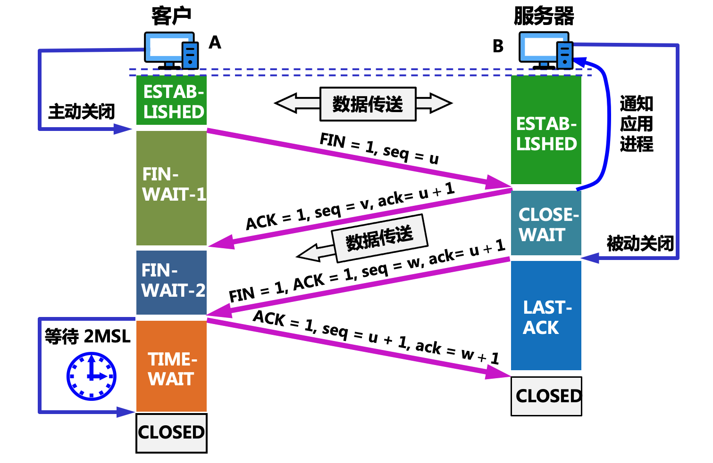

**第一次挥手**：客户端发送 **FIN = 1**，并且其数据部分序号为 **seq = u**(仅一个字节数据)。 

**第二次挥手**：服务器收到**释放连接**的请求，那么**直接**回复 **ACK = 1**，表示**确认收到**客户端的释放请求。同时回复其确认号 **ack = u + 1 **(即服务端期望客户端发送的下一个字节)。同时如果服务端还有未发送完成的数据，此时服务端可以**继续**发送给客户端，直到数据发送完成。注意此时只能服务端给客户端发送数据，也就是主动发起释放连接的一方只能接受**不能再发送**了。

**第三次挥手**：服务器数据发送完成之后发送另一个**释放消息**，即 **FIN = 1**，同时 **ACK = 1**，表示收到客户端的消息，此时 ack 有效，且 ack = **u + 1**。同时服务端设置自己的序列号 seq = w。

**第四次挥手**：客户端收到服务器的释放报文后，需要**再次确认**。此时 **ACK = 1**(确认信息有效)，同时 **seq = u + 1**(客户端前一次发送 u 的基础上加 1)，ack = **w + 1**(表明收到服务器的 seq = w 的信息)。**四次挥手完成**。

四次挥手流程简化版如下。相当于客户端和服务端**都给**对方发送了 **FIN 和 ACK** 信息，只不过服务端的分成了两次，所以变成了四次挥手。

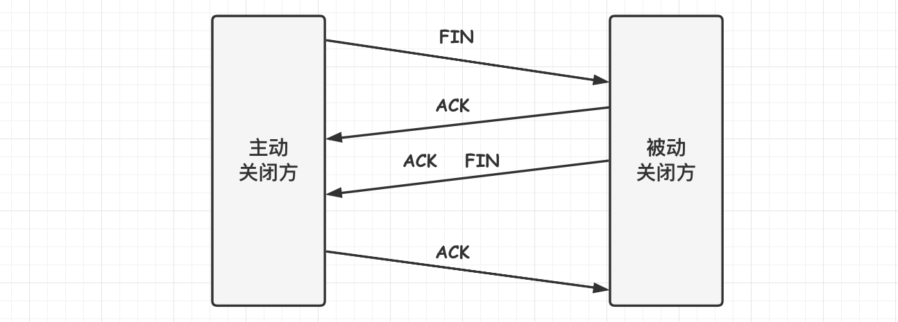

> **四次挥手的原因**

客户端发送了 FIN 连接释放报文之后，服务器收到了这个报文，就进入了 **CLOSE-WAIT** 状态。这个状态是为了**让服务器端发送还未传送完毕的数据**，传送完毕之后，服务器**会发送 FIN 连接释放**报文。

##### 2.TIME_WAIT与CLOSE_WAIT 

**TIME_WAIT** 和 **CLOSE_WAIT** 分别表示主动关闭方与被动关闭方产生的**阶段性状态**，如果在线服务器大量出现这两种状态则会加重机器负载，影响有效的连接。

**TIME_WAIT**：四次挥手之后之后主动关闭方**并不是直接进入 CLOSED** 状态，而是进入 **TIME_WAIT 状态**，等待 **==2MSL==** 的时间。**MSL** 中文可以译为 "**==报文最大生存时间==**"，它是任何报文在网络上**存在的最长时间**，超过这个时间报文将被**丢弃**。一般时间长度是 30 秒。等待 2MSL 时间主要**目的**是**怕最后一个 ACK** 包对方**没收到**，那么对方在**超时后将重发第三次握手的 FIN 包**，主动关闭端接到**重发的 FIN 包后可以再发一个 ACK 应答包**，从而确保四次挥手完成。在 TIME_WAIT 状态时**两端的端口不能使用**，要等到 2MSL 时间结束**才可继续使用**。当连接处于 2MSL 等待阶段时任何迟到的报文段都将被**丢弃**。

等待 2MSL 的两个理由：

- **确认被动关闭方能够顺利进入 CLOSED 状态**。也就是确保**最后一个确认报文**能够到达。如果 **B 没收到** A 发送来的**确认报文**，那么就会**重新发送连接释放**请求报文，A 等待一段时间就是为了处理这种情况的发生。
- **防止失效请求**。等待一段时间是为了让本连接持续时间内所产生的**所有报文都从网络中消失**，使得下一个新的连接**不会出现旧的连接**请求报文。

**CLOSE_WAIT：被动要求关闭的机器收到对方请求关闭连接的 FIN 报文，在第一次 ACK 应答后进入马上进入**。这种状态其实是在**等待关闭**，并且通知应用程序**发送剩余数据**，处理现场信息，关闭相应资源。

**注意**：由于 TIME_WAIT 状态无法真正释放句柄资源，此期间 Socket 中使用的本地端口在默认情况下是不能再被使用，对于高并发服务器来说，这会极大的限制有效连接的创建数量，成为性能瓶颈。所以建议将**高并发服务器的 TIME_WAIT 超时时间调小**。

##### 3.TCP连接状态总结

- **CLOSED**：初始状态。
- **LISTEN**：服务器处于监听状态。
- **SYN_SEND**：客户端 socket 执行 CONNECT 连接，发送 SYN 包，进入此状态。
- **SYN_RECV**：服务端收到 SYN 包并发送服务端 SYN 包，进入此状态。
- **ESTABLISH**：表示**连接建立**。客户端发送了最后一个 ACK 包后进入此状态，服务端接收到 ACK 包后进入此状态。
- **FIN_WAIT_1**：终止连接的一方(如客户端)发送了 FIN 报文后进入。**等待对方 FIN**。
- **CLOSE_WAIT**：(假设服务端)接收到客户端 FIN 包之后等待关闭的阶段。在接收到对方的 FIN 包之后，自然是需要立即回复 ACK 包的，表示已经知道断开请求。但是本方是否立即断开连接(发送 FIN 包)取决于是否还有数据需要发送给客户端，若有则在发送 FIN 包之前均为此状态。
- **FIN_WAIT_2**：此时是半连接状态，即有一方要求关闭连接，等待另一方关闭。客户端接收到服务器的 ACK 包，但并没有立即接收到服务端的 FIN 包，进入 FIN_WAIT_2 状态。
- **LAST_ACK**：服务端发动最后的 FIN 包，等待最后的客户端 ACK 响应，进入此状态。
- **TIME_WAIT**：客户端收到服务端的 FIN 包，并立即发出 ACK 包做最后的确认，在此之后的 2MSL 时间称为 TIME_WAIT 状态。

##### 4.其他

###### (1)保活计时器

保活计时器用来防止在 TCP 连接出现**长时期的空闲**。比如客户端**直接断电**，来不及发送释放的报文。**保活计时器**通常设置为 2 小时。若服务器过了 2 小时**还没有收到**客户端的信息，它就发送探测报文段。若发送了 10 个探测报文段还没有响应，就认为客户出了故障并主动**终止该连接**。

###### (2)TCP有限状态机

箭头旁边的字，表明引起这种变迁的原因，或表明发生状态变迁后又出现什么动作。

图中有三种不同的箭头。

- 粗实线箭头表示对**客户端**进程的正常变迁。
- 粗虚线箭头表示对**服务器**进程的正常变迁。
- 细线箭头表示异常变迁。 

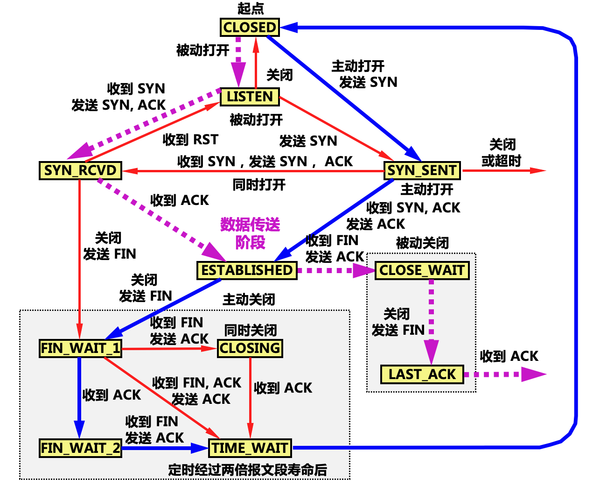

###### (3)TCP连接限制

TCP 连接的建立是通过**文件描述符(fd)** 完成的，通过创建套接字获取一个 fd，然后服务端和客户端需要基于获得的 fd 调用不同的函数分别进入监听状态和发起连接请求。**fd 的数量**决定了服务端进程能创建连接的数量。所以需要注意调整服务端进程和操作系统所支持的**最大文件句柄数**。

#### TCP协议保证可靠传输总结

总结一下 TCP 协议是如何保证传输可靠的，总结就是：**==ARQ 协议 + 滑动窗口协议==**。

1. **数据编号**：应用数据被分割成 TCP 认为最适合发送的**数据块**。TCP 给发送的每一个**数据包进行编号**，接收方对数据包进行排序，把有序数据传送给应用层。
2. **校验和**：TCP 将保持它首部和数据的**检验和**。这是一个端到端的检验和，目的是检测数据在传输过程中的任何变化。如果收到段的检验和有差错，TCP 将丢弃这个报文段和不确认收到此报文段。
3. **ARQ 协议**：每发完一个分组就停止发送，等待收到对方确认后再发下一个分组。为提高传输效率可以采用连续 ARQ 协议。
4. **超时重传**：当 TCP 发出一个**报文**后就启动一个**定时器**，如果超过定时器还没收到接收方的确认，就会重传报文。
5. **流量控制：**TCP 连接的每一方都有固定大小的缓冲空间，TCP 的接收端只允许发送端发送接收端缓冲区能接纳的数据。当接收方来不及处理发送方的数据，能提示发送方降低发送的速率，防止包丢失。TCP 利用滑动窗口实现流量控制。
6. **拥塞控制：**当网络拥塞时，减少数据的发送。包含慢开始、拥塞避免、快重传、快恢复等拥塞控制算法。


#### 参考资料

- 《计算机网络 第七版 谢希仁》
- [TCP新手误区--心跳的意义](https://blog.csdn.net/bjrxyz/article/details/71076442)


