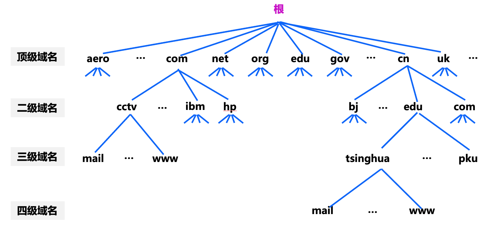
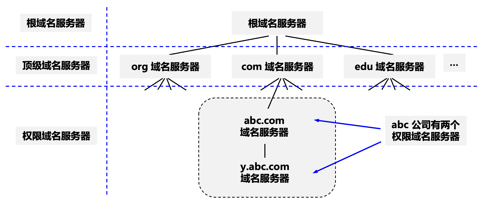
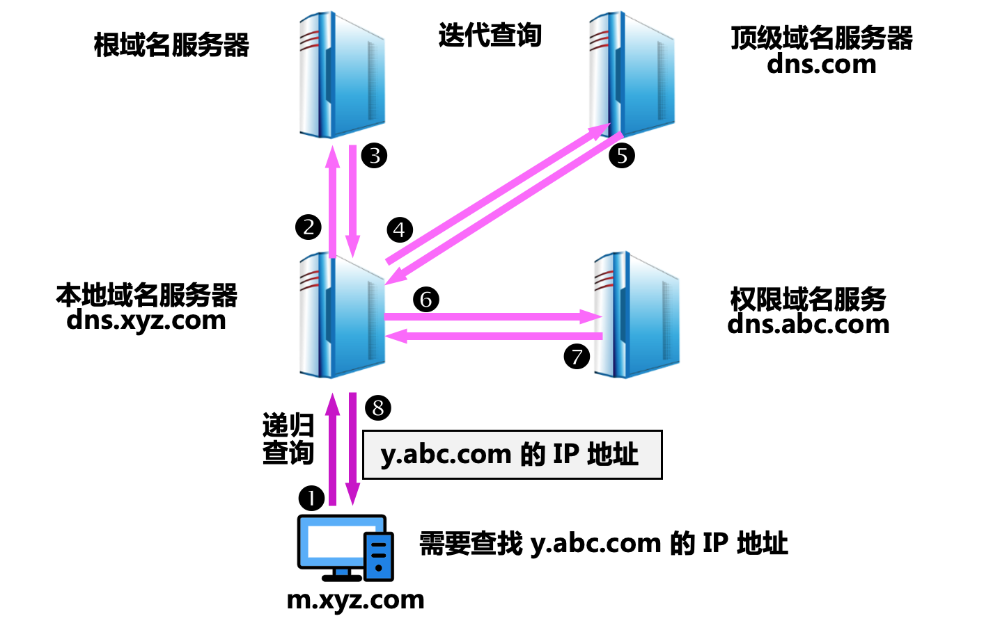
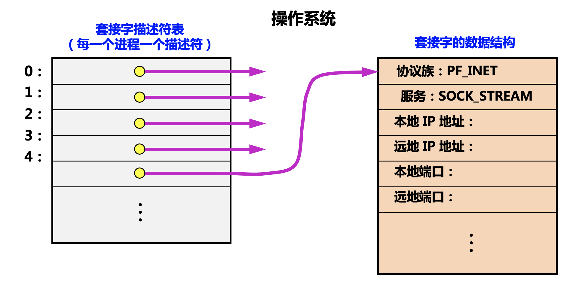
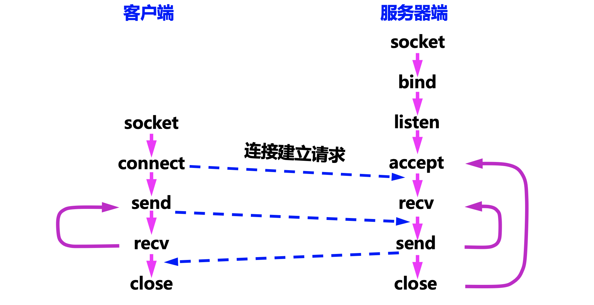

[TOC]

### 应用层

#### 概述

每个应用层协议都是为了解决**某一类应用问题**，应用层的具体内容就是规定应用进程在通信时所遵循的协议。

##### 1.应用层协议概述

|       应用       | 应用层协议 |  端口号   | 传输层协议  |             备注             |
| :--------------: | :--------: | :-------: | :---------: | :--------------------------: |
|     域名解析     |  **DNS**   |  **53**   | **UDP/TCP** | 长度超过 512 字节时使用 TCP  |
| 动态主机配置协议 |  **DHCP**  |   67/68   |   **UDP**   |                              |
|   文件传送协议   |  **FTP**   | **20/21** |   **TCP**   | **控制连接 21，数据连接 20** |
|   远程终端协议   |   TELNET   |  **23**   |     TCP     |                              |
|  超文本传送协议  |  **HTTP**  |  **80**   |   **TCP**   |                              |
| 简单邮件传送协议 |    SMTP    |    25     |   **TCP**   |                              |
|   邮件读取协议   |    POP3    |    110    |   **TCP**   |                              |
| 网际报文存取协议 |    IMAP    |    143    |   **TCP**   |                              |

#### 域名系统DNS

##### 1.域名结构

互联网采用**层次结构的命名树**作为主机的名字，并使用**分布式的域名系统 DNS**。任何一个连接在互联网上的主机或路由器，都有一个唯一的层次结构的名字，即**域名**。域名的结构由**标号序列**组成，各标号之间用点隔开。

```http
….三级域名.二级域名.顶级域名
```

各标号分别代表不同**级别**的域名。注意顶级域名在最后，如 .cn, .com, .edu 等。

**互联网域名空间**



##### 2.域名服务器

需要对域名进行解析才能获取到对应的服务的 IP 地址进行通信，域名到 IP 地址的**解析**是由**若干个域名服务器**程序完成的，域名服务器程序在**专设的结点**上运行，这称为**域名服务器(DNS 服务器)**。

**树状**结构的 **DNS 域名服务器**。



**权限域名服务器**：负责一个**区**的域名服务器。当一个权限域名服务器还不能给出最后的查询回答时，就会告诉发出查询请求的 DNS 客户端**下一步应当找哪一个权限域名服务器**。 

**本地域名服务器**：当一个**主机**发出 DNS 查询请求时，这个查询请求报文就**发送给本地域名服务器**。每一个互联网服务提供者 ISP，或一个**大学**，甚至一个大学里的系，都可以拥有一个本地域名服务器，这种域名服务器有时也称为**默认域名服务器**。

##### 3.域名解析过程

域名解析过程如下：

1. 找本地缓存。

2. 找本机的 hosts 文件。

3. 找 DNS 服务器。

**主机向==本地域名服务器==的查询一般都是采用==递归查询==**。如果主机所询问的**本地域名服务器不知道**被查询域名的 IP 地址，那么本地域名服务器就以 **DNS 客户的身份**，向其他**根域名服务器**继续发出查询请求报文。



每个域名服务器都维护一个**高速缓存**，存放最近用过的名字以及从何处获得**名字映射信息**的记录。可大大减轻根域名服务器的负荷，使互联网上的 DNS 查询请求和回答报文的数量大为减少，缓存应该设置合理的过期时间。

##### 4.DNS的传输协议

DNS 可以使用 **UDP 或者 TCP** 进行传输，使用的端口号都为 **53**。**大多数情况下 DNS 使用 ==UDP== 进行传输**。那 TCP 是可靠的，UDP 不可靠。DNS 应该是**可靠**的，但它使用 UDP，**为什么？**

- UDP 速度**更快**。TCP 很慢因为它需要 3 次握手。由于使用了 UDP，所以 DNS 服务器没有保持连接。
- DNS 请求通常非常小，非常适合 UDP 段。
- UDP 虽然不可靠，但可以在**应用层提供可靠性支持**。应用程序可以使用 UDP，并且可以通过在**应用程序层使用超时和重新发送**来实现可靠性。

在两种情况下会使用 **TCP** 进行传输：

- 如果返回的响应超过的 **512 字节**(UDP 最大只支持 512 字节的数据)。
- 区域传送。区域传送是**主域名服务器**向辅助域名服务器传送变化的那部分数据。

#### 动态主机配置协议DHCP

**DHCP**(Dynamic Host Configuration Protocol) 提供了**即插即用的连网方式**，用户不再需要手动配置 IP 地址等信息。这种机制允许一台计算机加入新的网络和获取 IP 地址，而不用手工配置。DHCP 配置的内容不仅是 IP 地址，还包括子网掩码、网关 IP 地址。

#### 电子邮件协议

一个电子邮件系统由三部分组成：用户代理、邮件服务器以及邮件协议。邮件协议包含发送协议和读取协议，发送协议常用 **SMTP**，读取协议常用 **POP3 和 IMAP**。这几个协议都是**基于 TCP** 的。

#### 应用进程网络间通信

##### 1.系统调用与套接字

大多数操作系统使用**系统调用**机制在应用程序和操作系统之间传递控制权。

**套接字**

- 当应用进程需要使用网络进行通信时就发出**系统调用**，请求操作系统为其创建 "**套接字**"，以便把网络通信所需要的系统资源分配给该应用进程。
- 操作系统为这些资源的总和用一个叫做**套接字描述符**的号码来表示。
- 应用进程所进行的**网络操作**都必须使用这个套接字描述符。
- 通信完毕后，应用进程通过一个关闭套接字的系统调用通知操作系统回收与该套接字描述符相关的所有资源。



##### 2.网络通信系统调用

当应用进程需要使用网络进行通信时，就发出**系统调用**。使用 TCP/IP 应用编程接口 API，就可以编写网络应用程序。调用 API 时，用户可以使用 TCP 或 UDP 等服务。如下是网络通信相关系统调用使用顺序的例子。




#### 参考资料

- 《计算机网络 第七版 谢希仁》

